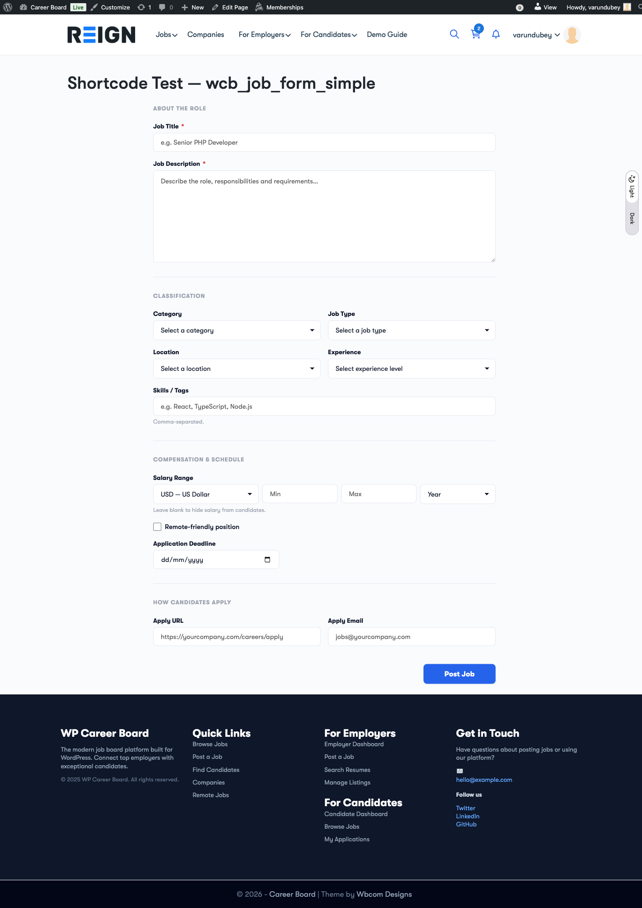
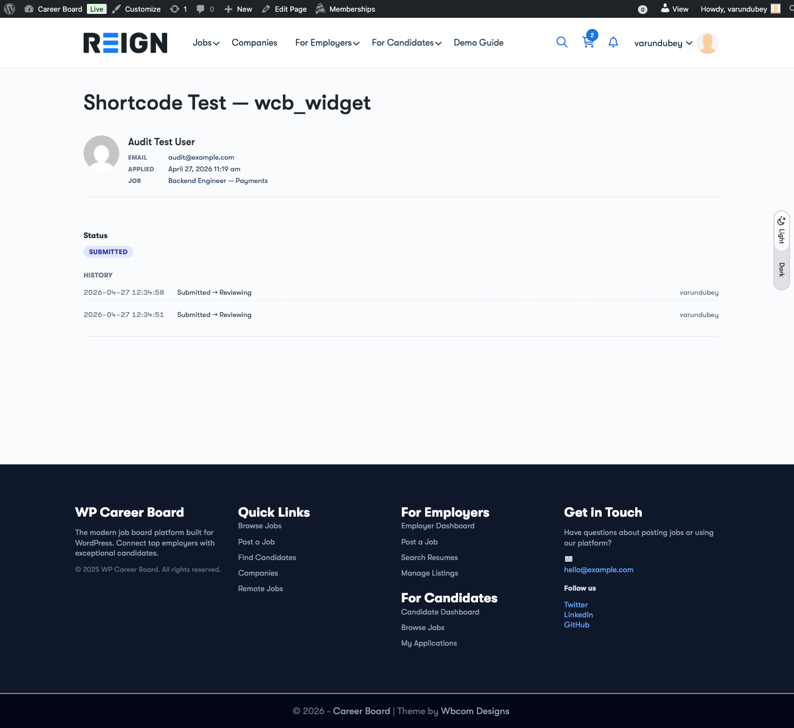

# WP Career Board — Shortcode Reference

Every block in WP Career Board is also exposed as a shortcode for sites
running classic editors, page builders (Elementor, Divi, Bricks, Beaver
Builder), or theme template hooks. Shortcodes forward attributes 1:1 to the
underlying block, so anything you can do in the block inserter you can do
from a shortcode field.

> **All shortcode attributes are forwarded** — numeric strings cast to
> `int`, `"true"`/`"false"` cast to `bool`, everything else stays a
> `string`. So `[wcb_job_listings perPage="6" boardId="42"]` produces the
> same output as the block with `{perPage: 6, boardId: 42}`.

---

## New in 1.1.0

| Shortcode | What it renders | Screenshot |
|-----------|------------------|------------|
| `[wcb_job_form_simple]` | Single-page job posting form (vs. multi-step wizard) |  |
| `[wcb_widget id="application/applicant-card" application_id="123"]` | Render any registered widget on a public page |  |

The existing job-listing/job-search/dashboard shortcodes also gained
attribute forwarding in 1.1.0 — see "Shortcode attributes" below.

---

## New in 1.2.0 — full block-to-shortcode coverage

Every frontend block in Free now ships with a matching shortcode so page
builders work without leaving their surface. Five blocks that previously
had no shortcode wrapper (`featured-jobs`, `job-filters`, `job-search-hero`,
`job-single`, `company-profile`) are now usable from any shortcode host.

| Shortcode | Block | Common attributes |
|---|---|---|
| `[wcb_job_listings]` | `wp-career-board/job-listings` | `boardId`, `perPage`, `metaFilter`, `showFilters` |
| `[wcb_job_search]` | `wp-career-board/job-search` | `placeholder`, `submitLabel` |
| `[wcb_job_search_hero]` | `wp-career-board/job-search-hero` | `headline`, `subheadline`, `bgImage` |
| `[wcb_job_filters]` | `wp-career-board/job-filters` | `boardId`, `showLocation`, `showType`, `showCategory` |
| `[wcb_job_form]` | `wp-career-board/job-form` | (multi-step wizard, no public attributes) |
| `[wcb_job_form_simple]` | `wp-career-board/job-form-simple` | (see section below) |
| `[wcb_job_single]` | `wp-career-board/job-single` | `jobId` (override `?p` context) |
| `[wcb_employer_dashboard]` | `wp-career-board/employer-dashboard` | (auto-scoped to current user) |
| `[wcb_candidate_dashboard]` | `wp-career-board/candidate-dashboard` | (auto-scoped to current user) |
| `[wcb_registration]` | `wp-career-board/employer-registration` | `redirect`, `successMessage` |
| `[wcb_company_archive]` | `wp-career-board/company-archive` | `perPage`, `orderBy` |
| `[wcb_company_profile]` | `wp-career-board/company-profile` | `companyId` (override post context) |
| `[wcb_job_stats]` | `wp-career-board/job-stats` | `boardId` |
| `[wcb_recent_jobs]` | `wp-career-board/recent-jobs` | `limit`, `boardId` |
| `[wcb_featured_jobs]` | `wp-career-board/featured-jobs` | `limit`, `boardId` |

For blocks with context-bound attributes (`jobId`, `companyId`), pass the
attribute when the host page doesn't provide a queried-post context — e.g.
on a custom Elementor page that's not the single-job template.

---

## `[wcb_job_form_simple]` — Single-Page Job Form

A single-page sibling of the multi-step wizard (`[wcb_job_form]`). Every
field on one screen — useful for sidebars, modal embeds, partner pages,
single-page sites, and classic themes without much vertical real estate.

Submits to the same `POST /wcb/v1/jobs` REST endpoint as the wizard and
honours the same field hooks (`wcb_job_form_fields`).

### Attributes

| Name | Type | Default | What it does |
|------|------|---------|--------------|
| `boardId` | int | `0` | Scope the form to a specific board (`wcb_board` post id). When set, the new job is created on that board. `0` means "no board". |
| `showCompanyField` | bool | `true` | Show the company-selection dropdown. Set `false` if your site posts on behalf of a single company. |
| `compact` | bool | `false` | Render the dense layout (smaller paddings, closer field rhythm) — good for sidebar embeds. |

### Examples

```text
[wcb_job_form_simple]
[wcb_job_form_simple boardId="42"]
[wcb_job_form_simple boardId="42" showCompanyField="false" compact="true"]
```

### Hooks

- `wcb_job_form_fields` — filter the form's field-group schema (shared with the wizard).
- `wcb_job_form_simple_initial_state` — extend the Interactivity API state.
- `wcb_job_form_simple_extra_fields` — render extra inputs after the built-in fields.

### When to use this vs. `[wcb_job_form]`

- **Wizard (`[wcb_job_form]`)** — best for sites where job posting is the primary CTA on its own page. Steps reduce cognitive load on long forms.
- **Single-page (`[wcb_job_form_simple]`)** — best when the form lives inside another flow (onboarding, modal, sidebar) where steps would feel heavy.

---

## `[wcb_widget]` — Mount Any Registered Widget on a Page

Renders any widget registered via `WCB\Core\Widgets\WidgetRegistry`. Every
attribute other than `id` is forwarded to the widget's render args, so the
same component renders identically inside an admin metabox or on a public
page.

### Attributes

| Name | Type | Default | What it does |
|------|------|---------|--------------|
| `id` | string | *(required)* | Widget id, e.g. `application/applicant-card`. |
| *(any other key)* | string | — | Forwarded to the widget. Common: `application_id`, `job_id`, `user_id`. |

### Built-in widget IDs (1.1.0)

| ID | What it renders |
|----|------------------|
| `application/applicant-card` | Applicant header card (avatar, name, contact, applied job, status). |
| `application/cover-letter` | The candidate's cover letter, formatted. |
| `application/resume-preview` | Embedded PDF/HTML resume preview with download link. |
| `application/status-changer` | Dropdown to change application status (employer-only). |
| `application/status-timeline` | Timeline of every status change with timestamps. |
| `application/quick-actions` | Email candidate, schedule interview, archive, hire. |

### Examples

```text
[wcb_widget id="application/applicant-card" application_id="1234"]
[wcb_widget id="application/cover-letter" application_id="1234"]
[wcb_widget id="application/status-timeline" application_id="1234"]
```

### Why this exists

Themes that build custom application-detail pages (e.g. behind a member
paywall) can compose them out of the same widgets the admin uses, instead
of hand-rolling markup that drifts out of sync. Add a custom widget by
extending `WCB\Core\Widgets\AbstractWidget` and registering it on
`init`:

```php
add_action( 'init', function () {
    \WCB\Core\Widgets\WidgetRegistry::instance()->register( new MyApp\Widgets\InterviewNotes() );
}, 20 );
```

---

## Existing shortcodes

All of these wrap a block. Every block attribute is forwarded — see each
block's `block.json` for the full list.

### `[wcb_job_listings]` — Job Listings Grid

Reactive job grid with infinite scroll, bookmark toggle, and chip-bar
filters.

| Attribute | Type | Default | What it does |
|-----------|------|---------|--------------|
| `perPage` | int | `0` (uses site default) | Page size for the listing. |
| `layout` | `grid` \| `list` | `grid` | Card grid or wide-row list. |
| `authorId` | int | `0` | Limit to jobs posted by a specific user. |
| `savedBy` | int | `0` | Show only jobs saved/bookmarked by the given user (e.g. logged-in candidate). |
| `boardId` | int | `0` | Scope to a specific board. |
| `metaFilter` | string | `""` | Allow-listed meta filter, format `key:value` (e.g. `_wcb_partner_id:5`). The REST endpoint enforces an allow-list. |

```text
[wcb_job_listings]
[wcb_job_listings perPage="9" layout="list"]
[wcb_job_listings boardId="42" metaFilter="_wcb_partner_id:5"]
```

### `[wcb_job_search]` — Search Hero

Headline + keyword/location search box that wires into the job listings
block via the Interactivity API store.

```text
[wcb_job_search]
```

### `[wcb_job_form]` — Multi-Step Wizard

Multi-step job-posting wizard. Same submission contract as
`[wcb_job_form_simple]`.

| Attribute | Type | Default | What it does |
|-----------|------|---------|--------------|
| `boardId` | int | `0` | Scope the new job to a board. |
| `showCompanyField` | bool | `true` | Show the company-selection step. |

```text
[wcb_job_form]
[wcb_job_form boardId="42"]
```

### `[wcb_employer_dashboard]` — Employer Dashboard

Full employer dashboard: my jobs, applications, company profile, billing.
Renders only for users granted the `wcb_post_jobs` ability.

```text
[wcb_employer_dashboard]
```

### `[wcb_candidate_dashboard]` — Candidate Dashboard

Full candidate dashboard: applications, saved jobs, resumes, alerts.
Renders only for logged-in users.

```text
[wcb_candidate_dashboard]
```

### `[wcb_registration]` — Employer Registration Form

Self-serve employer signup form. Creates a `wcb_employer` user and routes
to the employer dashboard.

```text
[wcb_registration]
```

### `[wcb_company_archive]` — Company Directory

Public listing of all companies with their open job counts.

```text
[wcb_company_archive]
```

### `[wcb_job_stats]` — Site-Wide Stats Strip

Counts of jobs, companies, candidates, hires. Lightweight — safe to drop
into any landing page.

```text
[wcb_job_stats]
```

### `[wcb_recent_jobs]` — Recent Jobs (Compact)

Compact list of the most recently published jobs. Good for sidebars and
footers.

| Attribute | Type | Default | What it does |
|-----------|------|---------|--------------|
| `count` | int | `5` | How many jobs to list. |

```text
[wcb_recent_jobs]
[wcb_recent_jobs count="3"]
```

---

## Pro shortcodes

The Pro plugin registers parallel shortcodes for resume search, the
single-page resume form, credit balance, and job alerts. See
[`wp-career-board-pro/docs/SHORTCODES.md`](../../wp-career-board-pro/docs/SHORTCODES.md).

---

## Shortcode attributes — what gets cast where

The shortcode wrapper around every block does the following:

1. Takes the raw `$atts` array.
2. For each key/value pair:
   - `"true"` / `"false"` → `bool`
   - Numeric integer-shaped strings (`"42"`) → `int`
   - Everything else → `string`
3. JSON-encodes the result into the block comment markup so the block
   receives them as proper attribute types matching `block.json`.

So `[wcb_job_listings perPage="9"]` arrives at the block as
`{ perPage: 9 }`, not `{ perPage: "9" }` — meaning your block's
`type: "integer"` validation passes.
