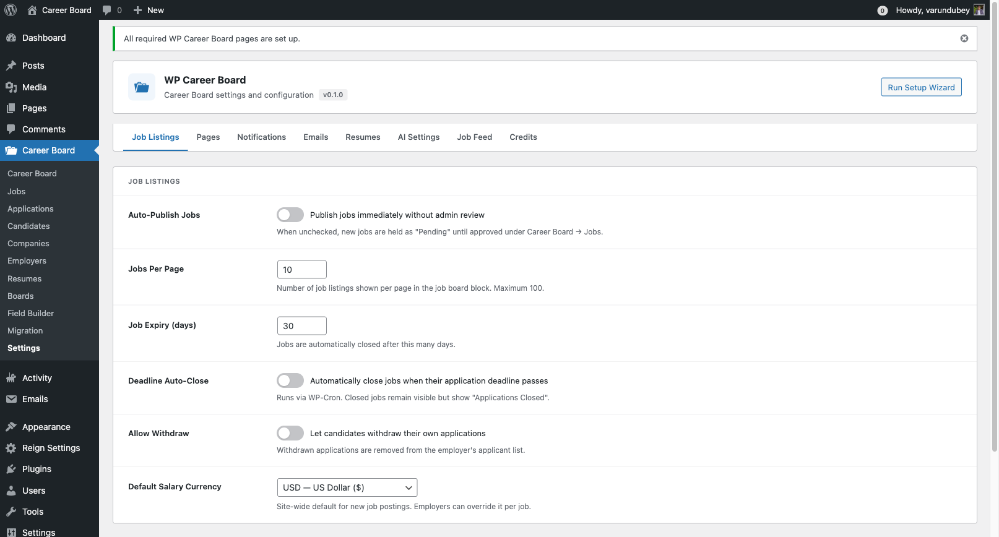

# Settings

Configure WP Career Board from **WP Career Board → Settings** in wp-admin. Settings are organized into tabs.

## Job Listings Tab

Controls how jobs behave on your board.

| Setting | Default | Description |
|---|---|---|
| **Auto-Publish Jobs** | Off | When on, submitted jobs go live immediately without admin approval |
| **Jobs Per Page** | 10 | Number of jobs shown per page in the listings grid |
| **Job Expiry (days)** | 30 | Jobs close automatically after this many days; 0 = no expiry |
| **Auto-Close on Expiry** | On | Automatically closes jobs when the expiry date passes |
| **Allow Application Withdraw** | On | Lets candidates withdraw their own applications |

## Pages Tab

Links each feature to its dedicated page. If the Setup Wizard ran successfully, these are filled in automatically.

| Setting | Purpose |
|---|---|
| **Jobs Page** | The main job board browse page |
| **Post a Job Page** | The page with the Job Form block |
| **Employer Dashboard Page** | The employer's management page |
| **Candidate Dashboard Page** | The candidate's tracking page |

If a page assignment is blank, the related functionality (e.g., "View your dashboard" links in emails) won't work correctly. Always fill these in.

> **With WP Career Board Pro:** a "Resume Builder Page" setting is also shown here.

## Notifications Tab

Controls which email notifications are enabled and lets you customize each email's subject and body. See [Email Notifications](./02-email-notifications.md) for the full guide.

## System Status Tab

Shows a health check of your installation:

- Plugin version
- WordPress and PHP version compatibility
- Database tables status (all tables created correctly)
- Page assignments check (are all required pages set?)
- Active integrations (BuddyPress, BuddyX Pro, Reign)

Use this tab when troubleshooting. It gives a quick overview of any configuration issues.

## Saving Settings

Click **Save Changes** at the bottom of any tab. Settings are saved per-tab — you don't need to switch tabs before saving.
