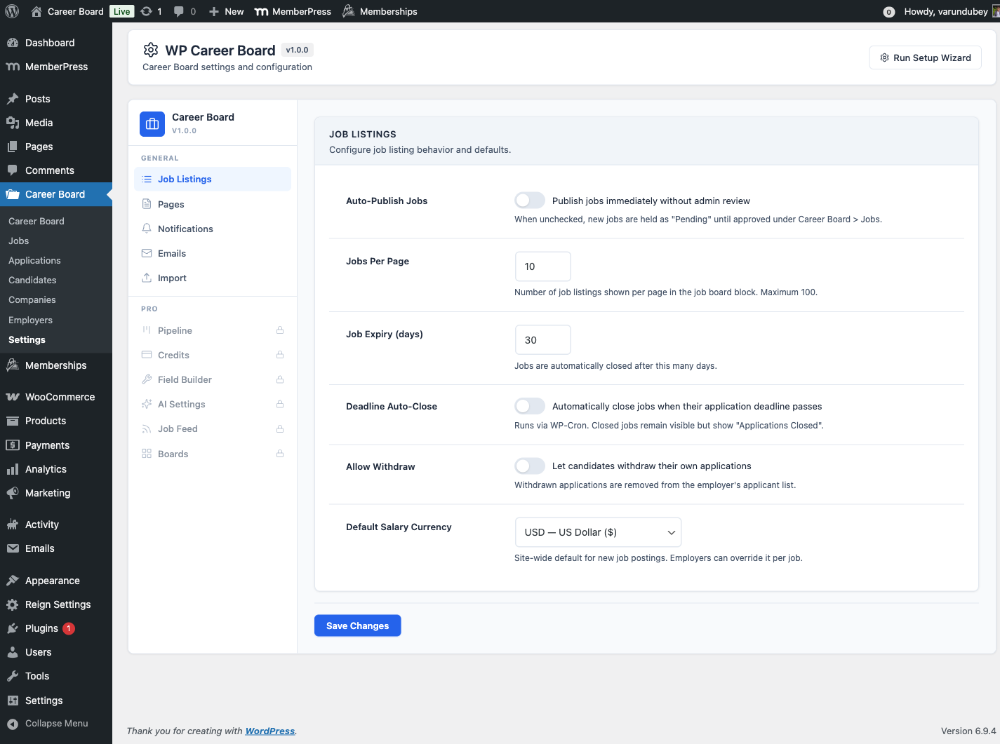

# Settings

Configure WP Career Board from **WP Career Board → Settings** in wp-admin. The sidebar groups tabs by the task they support, and each tab saves independently.

## Jobs & Applications

| Tab | What It Controls |
|---|---|
| **Jobs** | Auto-Publish Jobs, default listing length, When a job ends, Jobs Per Page, Default Salary Currency, Featured Duration |
| **Applications** | Resume Required, Application Resume File Size, Allow Withdraw |
| **Boards** (Pro) | Multi-board engine: create and manage independent job boards |
| **Field Builder** (Pro) | Custom fields for jobs, companies, and candidates |
| **Pipeline** (Pro) | Application pipeline stages |
| **Job Feed** (Pro) | RSS/JSON feed settings for job listing aggregators |
| **Industries** | Industry taxonomy used for filtering and matching |
| **Import** | One-click migration from WP Job Manager. See [Import & Migration](./05-import.md) |

### Jobs

| Setting | Default | Description |
|---|---|---|
| **Auto-Publish Jobs** | Off | When on, submitted jobs go live immediately without admin approval. When off, new jobs are held as Pending until approved under Career Board → Jobs |
| **Default listing length (days)** | 30 | How long a job stays open when the employer sets no deadline (1-365). A board's own listing length, if set, wins over this default. Closing is reversible - open the job in admin and republish |
| **When a job ends** | - | Not a switch. At its deadline a job stops taking applications and leaves the listings, feeds and sitemap within the hour (hourly WP-Cron). Its page stays up as an expired page (noindex, similar open jobs) so shared links keep working; employers reopen it from their dashboard with a new deadline. Sites set up before 1.8.0 that had "Deadline Auto-Close" off keep listing past-deadline jobs until you click **End jobs at their deadline** here. Only jobs that ended in the last 7 days email their employer, so switching on does not email about an old backlog |
| **Jobs Per Page** | 10 | Number of jobs shown per page in the job board block (1-100) |
| **Default Salary Currency** | USD | Site-wide default currency for new job postings; employers can override per job |
| **Featured Duration (days)** | 30 | How many days a job stays in the Featured spotlight before reverting automatically (1-365). See [Featured Listing Expiry](./08-featured-expiry.md) |

### Applications

| Setting | Default | Description |
|---|---|---|
| **Resume Required** | On | Require applicants to attach a resume on the apply form. Turn off for boards where a cover letter alone is enough |
| **Application Resume File Size (MB)** | 5 | Maximum size for an uploaded resume file (1-20 MB) |
| **Allow Withdraw** | On | Lets candidates withdraw their own applications. Turn off for apply-once-final flows (compliance, regulated hiring) |

## Candidates & Employers

| Tab | What It Controls |
|---|---|
| **Sign-ups** | Open Sign-Up status, Email Verification, Require Candidate Role |
| **Resumes** (Pro) | Resume visibility, file upload, and resume builder settings |
| **Credits** (Pro) | Credit settings, product-to-credit mappings, detected payment providers, and credits-per-job-post value |
| **Privacy** | Candidate and employer data handling |

### Sign-ups

| Setting | Default | Description |
|---|---|---|
| **Open Sign-Up** | (read-only status) | Shows whether candidates and employers can create their own accounts. This mirrors WordPress's "Anyone can register" setting - the tab links to **Settings → General** to change it |
| **Email Verification** | Off | New candidates and employers confirm their email before they can sign in. Uses the "Confirm Your Email" message under the Emails tab; if that message is off, sign-ups are not held |
| **Require Candidate Role** | Off | Off lets any logged-in member apply and manage a resume (ideal for community sites). Turn on to reserve the candidate experience for users with the Candidate role |

## Emails & App

| Tab | What It Controls |
|---|---|
| **Brand** | One colour and one logo used by every Career Board email, the mobile app and the installable app (PWA). Your website itself follows your theme |
| **Emails** | Sender name, sender email, admin notification address, plus per-notification enable/disable and customization. See [Email Notifications](./02-email-notifications.md) |
| **Mobile App** | App branding, legal links, and sign-in options for the companion app |

The **Brand** tab holds the Brand Colour and the Logo (picked from the Media Library). Emails paint their header in the Brand Colour and show the logo; the app and the installable app use the same colour and logo. On sites that existed before 1.8.0, the Brand starts as your old email header colour and logo, so emails look the same.

The Emails tab opens with a **Sender** card at the top (From Name, From Email, Admin Notification Email) used by every WCB email, followed by the per-template list. Any older link to a separate "Notifications" tab now opens Emails.

The Mobile App tab has its own **Save Changes** button, separate from Emails. It controls the app's sign-in background and dark mode (its colour and logo come from **Brand**), legal links (terms, EULA, community guidelines, abuse contact), and **App Password Sign-In** (off by default - the app can already sign members in via "Connect with WordPress" without it).

## Site

| Tab | What It Controls |
|---|---|
| **Pages** | Assigns the WordPress pages that contain each WP Career Board block |
| **Anti-Spam** | Honeypot plus an optional CAPTCHA provider |
| **AI Settings** (Pro) | AI provider key for AI Chat Search and job description generation |
| **Analytics** (Pro) | Analytics and reporting settings |
| **Integrations** | Third-party service connections and API integrations |
| **Advanced** | Content Width, Remove Data on Delete |
| **License** (Pro) | Pro license key activation and management |

On phones, the sidebar collapses and every tab is listed under its group label, so the grouping stays the same at any screen size.

### Pages

Links each feature to its dedicated page. If the Setup Wizard ran successfully, these are filled in automatically. A **Create Missing Pages** button creates any page that is not yet assigned - it keeps pages you already have and adopts an existing page that already contains the right block, so it never creates a duplicate.

| Setting | Purpose |
|---|---|
| **Jobs Archive Page** | The main job board browse page (Find Jobs, `/find-jobs/`) |
| **Employer Dashboard Page** | The employer's management page |
| **Candidate Dashboard Page** | The candidate's tracking page |
| **Company Archive Page** | The public company directory (Find Companies, `/find-companies/`) |
| **Post a Job Page** | The standalone job-submission page |
| **Employer Registration Page** | The employer sign-up page |
| **Find Candidates Page** (Pro) | The candidate directory (used when WP Career Board Pro is active). Slug `/find-candidates/`; older `/find-resumes/` pages from before 1.8.0 still work |
| **Job Map Page** (Pro) | Jobs plotted on a map with a radius filter, slug `/job-map/` |

If a page assignment is blank, related functionality (e.g. "View your dashboard" links in emails) won't work correctly. Always fill these in.

### Anti-Spam

A honeypot field protects every submission form automatically (no setup, no
performance cost). For a stronger second layer, choose a CAPTCHA provider:

- **None** - honeypot only (default).
- **Cloudflare Turnstile** - enter the Turnstile Site Key and Secret Key.
- **Google reCAPTCHA v3 (invisible, score)** - enter the reCAPTCHA Site Key,
  Secret Key, and an optional score threshold (default 0.5).
- **Google reCAPTCHA v2 (invisible badge)** - enter the reCAPTCHA Site Key
  and Secret Key. Create these keys in Google's console as reCAPTCHA v2,
  "Invisible reCAPTCHA badge" - a different key type than v3.

A CAPTCHA only runs once the chosen provider has both a site key and a
secret key saved. Switching providers keeps the keys you already entered for
the other providers, so you can switch back without retyping them. The
chosen provider guards both the job-submission and job-application forms.

### Advanced

| Setting | Default | Description |
|---|---|---|
| **Content Width (px)** | 0 (follow theme) | How wide Career Board pages run. Leave at 0 to follow your theme; set 720-1920 only if plugin pages need to differ from the rest of the site |
| **Remove Data on Delete** | Off | Off keeps all your data (jobs, applications, companies, resumes, uploaded files, credit balances, settings, roles) when the plugin is deleted, so a reinstall picks up where you left off. Turn on only when removing Career Board for good - deleting Free or Pro then erases everything, including uploaded resume files, and cannot be undone. Deactivating the plugin never deletes data, regardless of this setting |

## Saving Settings

Click **Save Changes** at the bottom of any tab. Settings are saved per-tab - you don't need to switch tabs before saving.
