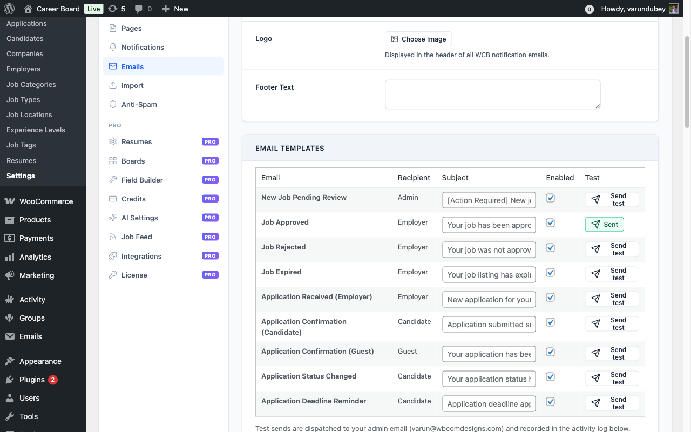

# Email Notifications

WP Career Board sends automatic emails for key events. All emails use WordPress's built-in `wp_mail()` function and are fully customizable.


## Notification Events

| Email | Sent To | Trigger |
|---|---|---|
| **New Job Pending Review** | Admin | Employer submits a new job |
| **Job Approved** | Employer | Admin approves a pending job |
| **Job Rejected** | Employer | Admin rejects a pending job |
| **Job Expired** | Employer | Job reaches its expiry date |
| **Application Received** | Employer | Candidate applies to their job |
| **Application Confirmation (Candidate)** | Candidate | Registered candidate submits an application |
| **Application Confirmation (Guest)** | Guest | Guest applicant submits an application |
| **Application Status Changed** | Candidate | Employer updates application status (Reviewing, Shortlisted, Rejected, Hired) |

## Managing Notifications

Go to **WP Career Board → Settings → Emails**.

Each notification can be:
- **Enabled or disabled** - toggle the switch to turn it on or off
- **Customized** - edit the email subject and body text

Click the email name to expand the editor for that notification.

### Editable body per template

Every notification ships with a ready-to-use default body, and since
1.6.0 that body is fully editable per template from this screen. Leave
the body field blank to send the shipped default, or type your own
text to override it - a **Load default** button next to the field
loads the shipped wording back in as a starting point if you want to
edit from there instead of writing from scratch. If a template's body
is left empty, the email still sends with its sensible default rather
than going out blank.

## Send Test Email

Each template ships with a **Send test** button on the right of the row. Clicking it dispatches a one-shot copy of that email to the admin user's address with sample merge-tag values, so you can preview the rendered template before any real applicant sees it.



The button works for both enabled and disabled templates - disabled templates are still rendered and dispatched for preview, but their log rows are tagged `sent_test` in the activity log so admin previews stay separate from production delivery metrics. A green check + "Sent" label appears for 2.5 seconds after a successful dispatch, then resets.

If the button shows "Failed", check:
- An SMTP plugin is configured (the local dev mail handler often fails silently)
- The admin user has a valid email address on their profile
- The Email Activity Log row says `sent_test` for the most recent attempt - if the row is missing, see the [self-heal note](#email-activity-log) below

## Email Placeholders

Use these placeholders in email subjects and bodies - they are replaced with real values when the email sends:

| Placeholder | Value |
|---|---|
| `{job_title}` | The job listing title |
| `{company_name}` | The employer's company name |
| `{candidate_name}` | The applicant's full name |
| `{application_status}` | Current status of the application |
| `{dashboard_url}` | Link to the employer or candidate dashboard |
| `{job_url}` | Link to the job listing page |
| `{site_name}` | Your WordPress site name |

## Email From Name and Address

Go to **WP Career Board → Settings → Notifications** to set:
- **From Name** - the sender name shown in inboxes (e.g. "Career Board")
- **From Email** - the reply-to address for all WCB emails
- **Admin Notification Email** - where admin alerts (e.g. new job pending review) are sent

## SMTP / Deliverability

For reliable email delivery, use an SMTP plugin (WP Mail SMTP, FluentSMTP, or similar). WordPress's built-in mail function can land in spam without SMTP configuration.

## Email Activity Log {#email-activity-log}

Every dispatched email writes a row to `wp_wcb_notifications_log` and surfaces on the **Activity Log** tab at the bottom of Settings → Emails. Rows show the event type, channel, recipient, status (`sent` / `failed` / `sent_test` / `failed_test`), and timestamp.

The log table is created on plugin activation. If for any reason the table is missing (e.g. a database migration dropped it, or the plugin was installed pre-1.0.x and skipped the activation routine), the dispatch path self-heals the table on first send rather than failing silently - your previously missing log entries will start populating from the next dispatch onward.

---

## Pro Email Notifications (Pro)

WP Career Board Pro extends the email system with three additional transactional emails. You can customise the subject line and enable or disable each one from **Career Board -> Settings -> Emails**.

### Job Alert Digest

- **Recipient:** Candidate
- **Trigger:** Fired when the Job Alerts module finds new jobs matching a candidate's saved search
- **Content:** A list of matching job titles with direct links

### Credit Top-Up Confirmation

- **Recipient:** Employer
- **Trigger:** When a credit purchase completes via a supported payment gateway (WooCommerce, Paid Memberships Pro, or MemberPress)
- **Content:** Confirmation of the purchase and updated balance

### Low Credit Balance Warning

- **Recipient:** Employer
- **Trigger:** Fired when an employer's credit balance reaches zero
- **Content:** Balance warning and a link to the Employer Dashboard to purchase more credits

### Email Template Customisation

All Pro emails use the same templating system as Free emails. To override a template, copy the relevant file into your theme's `wp-career-board/emails/` folder (the same override location Free uses), or register a custom template directory with the `wcb_email_template_dirs` filter.

## In-App Notification Bell (Pro)

The notification bell appears in the Employer Dashboard and Candidate Dashboard. It shows a live unread count and drops down to display a list of recent notifications, each with a message and a link to the relevant page.

### Events That Trigger Bell Notifications

| Event | Who Receives It | Message Example |
|-------|----------------|----------------|
| Application submitted | Employer | "Jane Doe applied for Senior PHP Developer" |
| Application submitted | Candidate | "Your application for Senior PHP Developer was submitted" |
| Application status changed | Candidate | "Your application for Senior PHP Developer is now Shortlisted" |
| Job approved | Employer | "Your job 'Senior PHP Developer' has been approved" |
| Job rejected | Employer | "Your job 'Senior PHP Developer' was not approved" |
| Job expired | Employer | "Your job 'Senior PHP Developer' has expired" |

All notifications are stored in the `wcb_notifications` database table. The `is_read` flag is set to `0` on insert. The bell badge count reflects the number of unread rows for the current user.

## Deadline reminders {#deadline-reminders}

New in 1.1.0 - candidates who saved a job but haven't applied get
automated reminders before the application deadline closes.

### Reminder schedule

| When | Email |
|---|---|
| **3 days** before the deadline | "Your saved job is closing soon" reminder |
| **1 day** before the deadline | "Last chance to apply" final reminder |

Both reminders are skipped if:

- The candidate has already submitted an application for that job, OR
- The candidate has un-saved the job, OR
- The job has been closed / removed before the cron fires.

### Cron event

Registered as `wcb_send_deadline_reminders`, runs daily.

WordPress's wp-cron triggers it on the next page load after the
scheduled time - for low-traffic sites, install a real cron job that
hits `wp-cron.php` to keep timing accurate.

To trigger manually:

```bash
wp cron event run wcb_send_deadline_reminders
```

### Disabling deadline reminders

The deadline reminder is one of the email templates on the **Career
Board → Settings → Emails** tab. Toggle its **Enabled** switch off to
stop the reminders. The cron stays scheduled (so re-enabling is one
click) but the disabled template is not dispatched.

Toggling the template off is the supported way to stop the reminders and
is all most sites need.

To stop the cron entirely as well (for example, on a staging environment),
unschedule the event with WP-CLI:

```bash
wp cron event delete wcb_send_deadline_reminders
```

Or unschedule it in code:

```php
$timestamp = wp_next_scheduled( 'wcb_send_deadline_reminders' );
if ( $timestamp ) {
    wp_unschedule_event( $timestamp, 'wcb_send_deadline_reminders' );
}
```

The plugin re-schedules the event on the next page load, so deleting it is
mainly useful when the plugin is also being deactivated.

### Email template

Standard plugin email format with the configured logo, header/footer.
Subject line: "Your saved job '{{job_title}}' closes in {{days}} days".

Custom merge tags available:

| Tag | Value |
|---|---|
| `{{candidate_name}}` | Candidate first name |
| `{{job_title}}` | Title of the saved job |
| `{{company_name}}` | Company that posted the job |
| `{{deadline_date}}` | Localized deadline date |
| `{{days}}` | Days until deadline |
| `{{job_url}}` | Direct link to the job page |

Override the template by copying `modules/notifications/templates/emails/deadline-reminder.php`
into your theme's `wp-career-board/emails/` folder.
