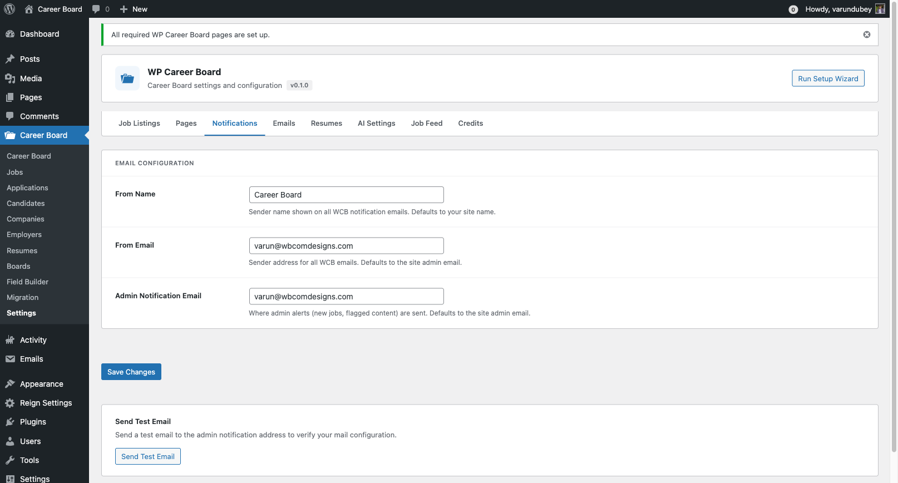

# Email Notifications

WP Career Board sends automatic emails for key events. All emails use WordPress's built-in `wp_mail()` function and are fully customizable.

## Notification Events

| Email | Sent To | Trigger |
|---|---|---|
| **New Application Received** | Employer | A candidate submits an application |
| **Application Status Changed** | Candidate | Employer updates application status (Reviewed, Shortlisted, Closed) |
| **Application Withdrawn** | Employer | Candidate withdraws their application |
| **Job Approved** | Employer | Admin approves a pending job listing |
| **Job Rejected** | Employer | Admin rejects a pending job listing |
| **Job Expiry Reminder** | Employer | Job is about to expire (sent 3 days before) |
| **Job Expired** | Employer | Job has expired and been closed |
| **New Employer Registration** | Admin | A new user registers as an employer |
| **New Candidate Registration** | Admin | A new user registers as a candidate |

## Managing Notifications

Go to **WP Career Board → Settings → Notifications**.

Each notification can be:
- **Enabled or disabled** — toggle the switch to turn it on or off
- **Customized** — edit the email subject and body text

Click the email name to expand the editor for that notification.

## Email Placeholders

Use these placeholders in email subjects and bodies — they are replaced with real values when the email sends:

| Placeholder | Value |
|---|---|
| `{job_title}` | The job listing title |
| `{company_name}` | The employer's company name |
| `{candidate_name}` | The applicant's full name |
| `{application_status}` | Current status of the application |
| `{dashboard_url}` | Link to the employer or candidate dashboard |
| `{job_url}` | Link to the job listing page |
| `{site_name}` | Your WordPress site name |

## Email From Name and Address

WP Career Board uses the default WordPress mail settings for the sender name and email address. To change these, go to **Settings → General** in wp-admin, or use a WordPress SMTP plugin to configure a custom from address.

## SMTP / Deliverability

For reliable email delivery, use an SMTP plugin (WP Mail SMTP, FluentSMTP, or similar). WordPress's built-in mail function can land in spam without SMTP configuration.

> **With WP Career Board Pro:** advanced notification channels are available — SendGrid, Mailgun, Amazon SES, Twilio SMS, and browser push notifications via VAPID keys.
