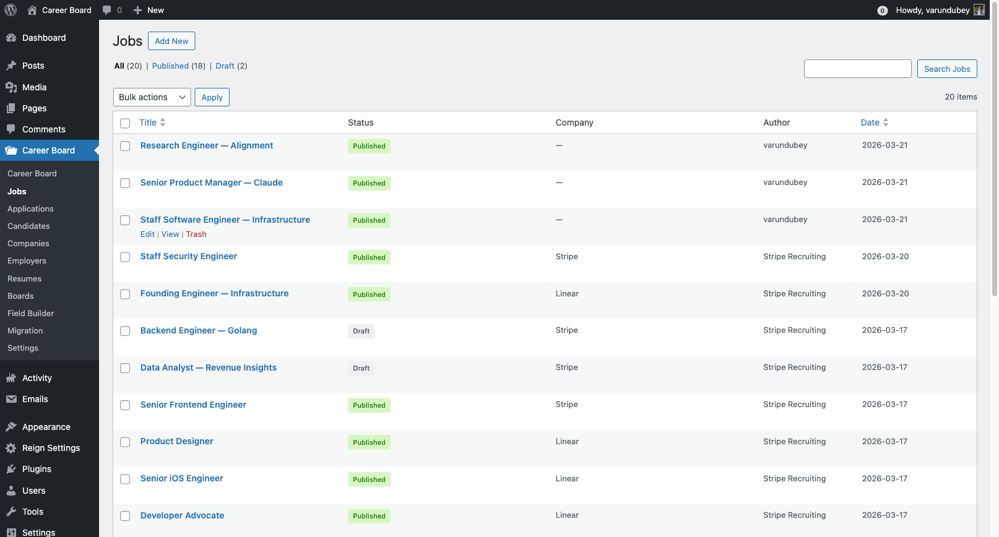

# Moderation

Moderation controls whether jobs need admin approval before they go live. It prevents spam and low-quality listings on your board.

## How Moderation Works

When **Auto-Publish Jobs** is turned **off** (the default), every job submitted by an employer goes to a **Pending** state and must be approved by an admin before it appears on the job board.

When **Auto-Publish Jobs** is turned **on**, submitted jobs go live immediately without review.

To toggle moderation: **WP Career Board → Settings → Job Listings → Auto-Publish Jobs**

## Reviewing Pending Jobs

1. Go to **WP Career Board → Jobs** in wp-admin
2. Click the **Pending** filter at the top of the list
3. Click any job title to open the full edit screen and review the content

## Approving a Job

**Quick approval (from the list):**
1. Hover over the job in the list
2. Click **Approve** under the title

**Full review (from the edit screen):**
1. Open the job in the wp-admin editor
2. Review all details
3. Change the status to **Published** in the Post Status panel
4. Click **Update**

When a job is approved, the employer receives an email notification.

## Rejecting a Job

1. Open the job in the wp-admin editor
2. Change the status to **Draft** or **Trash**
3. Optionally email the employer with a reason (done manually outside the plugin)

## Managing Existing Jobs

Admins have full control over all jobs from **WP Career Board → Jobs**:

- **Edit** any job (correct errors, add missing info)
- **Close** a job that is running too long
- **Delete** spam or low-quality listings

## Admin Notifications

Admins receive an email when:
- A new employer registers
- A new candidate registers

These keep you informed of who is joining your board. Notification content can be customized in **Settings → Notifications**.
