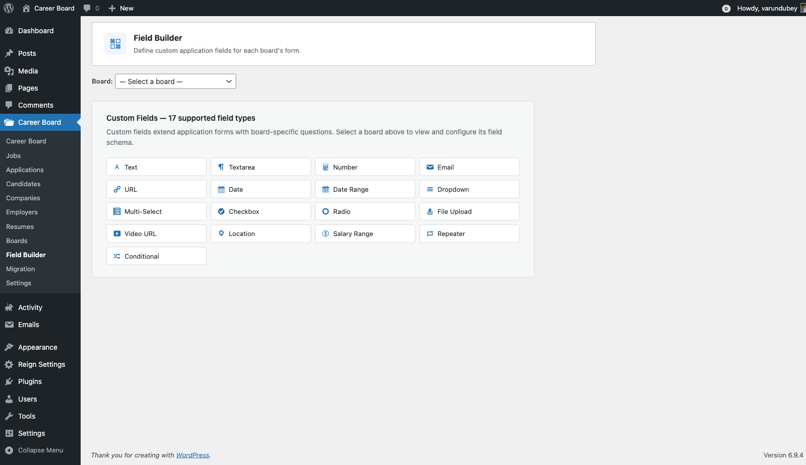
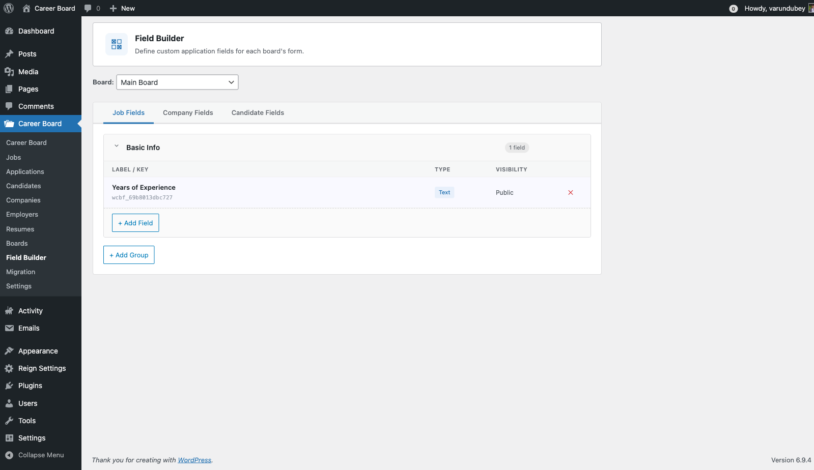

# Custom Field Builder

> **Pro feature** — Requires WP Career Board Pro.

The Field Builder lets you add custom fields to job listings, company profiles, and candidate profiles — no code required. Fields appear automatically in the relevant forms and public pages.

## What You Can Add

- Fields to **job listings** — e.g., Remote Policy, Visa Sponsorship, Tech Stack
- Fields to **company profiles** — e.g., Funding Stage, Team Size, Benefits
- Fields to **candidate profiles** — e.g., Notice Period, Preferred Work Style, Portfolio URL

## Accessing the Field Builder

Go to **Career Board → Settings → Field Builder** in wp-admin.

You will see three tabs:
- **Job Fields** — fields added to job listings
- **Company Fields** — fields added to company profiles
- **Candidate Fields** — fields added to candidate profiles

## Creating a Field Group

Fields are organized into groups — collapsible sections with a label (e.g., "Compensation Details").

1. Click **Add Group**
2. Enter a group label
3. Click **Save Group**

You can create multiple groups to organize related fields.

## Adding a Field

1. Expand the group where you want to add the field
2. Click **+ Add Field**
3. Configure the field:

| Setting | Description |
|---|---|
| **Field Label** | The label shown on the form and public page |
| **Field Type** | Text, Textarea, Number, Select, Checkbox, Date, URL, File Upload |
| **Required** | Whether the field must be filled in |
| **Visibility** | Public, Logged In Only, Employer Only, Candidate Only |
| **Placeholder** | Hint text shown inside the input |
| **Options** | The choices available (for Select and Checkbox fields) |

4. Click **Save Field**

## Field Types

| Type | Use for |
|---|---|
| **Text** | Short values — tech stack, notice period, LinkedIn URL |
| **Textarea** | Longer text — benefits overview, culture note |
| **Number** | Salary, team size, years of experience |
| **Select** | Single-choice dropdown — Remote Policy, Visa Sponsorship |
| **Checkbox Group** | Multiple choices — Benefits, required skills |
| **Toggle** | Single on/off — "Visa sponsorship available?" |
| **Date** | Application deadline, estimated start date |
| **URL** | Portfolio, GitHub, external job link |
| **File Upload** | Attach a PDF, document, or image |

## Visibility Rules

Each field can be set to:
- **Public** — visible to all visitors including guests
- **Logged in only** — visible to registered users only
- **Employer only** — visible only to employers (e.g., on the job form)
- **Candidate only** — visible only to candidates

## Reordering

Drag and drop fields within a group to reorder them. Drag and drop groups to change their order. Changes save automatically.

## Deleting a Field

Click **Delete** on any field. This permanently removes the field **and all stored values** across all posts. This cannot be undone.

## Where Fields Appear

| Field Type | Appears in | Displayed on |
|---|---|---|
| Job Fields | Multi-step Job Form | Job single page |
| Company Fields | Company Profile editor | Public company page |
| Candidate Fields | Candidate profile settings | Candidate profile |
