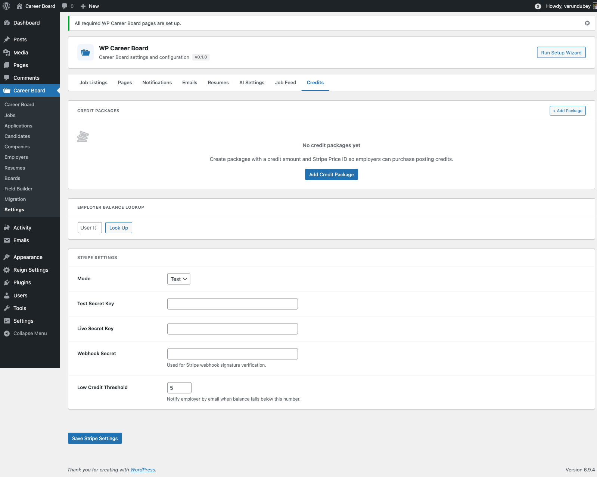
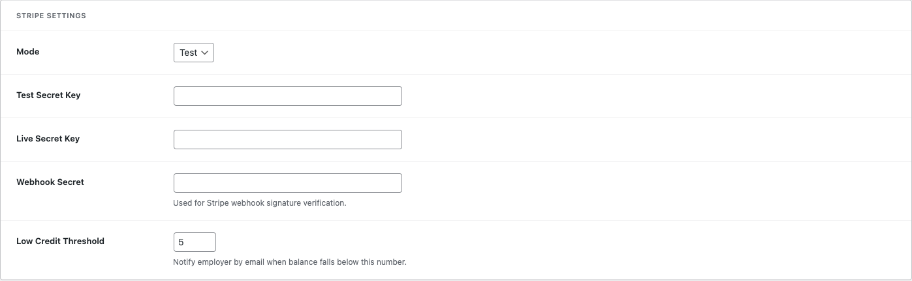
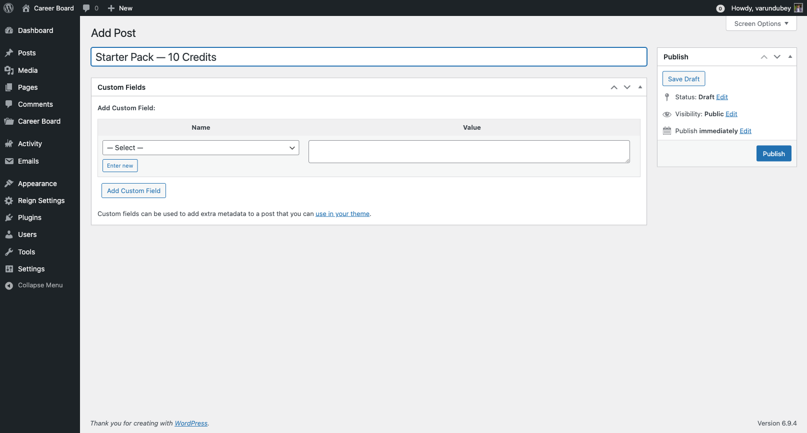

# Credit System

> **Pro feature** — Requires WP Career Board Pro.

The Credit System lets you charge employers credits to post jobs. You sell credit packages, employers buy credits via Stripe Checkout, and credits are deducted automatically when jobs go live.

## How It Works

1. **Admin sets the price** — configure how many credits a job post costs
2. **Admin creates packages** — define credit bundles to sell (e.g., "5 credits for $49")
3. **Employer buys credits** — pays via Stripe Checkout, credits added instantly
4. **Credits held on submit** — when the employer submits a job, the required credits are reserved
5. **Credits deducted on approval** — when the job goes live, credits are consumed
6. **Refund on rejection** — if the admin rejects a job, held credits are returned

## Credit Ledger

Every transaction is logged in an append-only audit trail:

| Type | Effect |
|---|---|
| **Top-up** | Credits added (from a purchase) |
| **Hold** | Credits reserved (job submitted, awaiting approval) |
| **Deduct** | Credits consumed (job approved and live) |
| **Refund** | Credits returned (job rejected or cancelled) |

## Step 1: Configure Stripe

WP Career Board Pro uses Stripe Checkout to process purchases. Your site must be on HTTPS.

### Getting Your Stripe Keys

1. Log in to your Stripe Dashboard
2. Go to **Developers → API Keys**
3. Copy your **Publishable key** and **Secret key**

Use **Test mode** keys while testing, then switch to live keys when ready.

### Adding Keys to WP Career Board

1. Go to **WP Career Board → Settings → Credits**
2. Paste your **Publishable Key** and **Secret Key**
3. Click **Save Changes**



### Setting Up the Webhook

Stripe sends a webhook to your site when a payment completes. This is how credits are added after a purchase.

1. In your Stripe Dashboard, go to **Developers → Webhooks → Add Endpoint**
2. Enter your webhook URL:
   ```
   https://yourdomain.com/wp-json/wcb/v1/stripe/webhook
   ```
3. Select events: `checkout.session.completed`, `payment_intent.succeeded`, `payment_intent.payment_failed`
4. Click **Add Endpoint**, then copy the **Webhook Signing Secret**
5. Paste the signing secret into **WP Career Board → Settings → Credits → Webhook Secret**



### Test a Purchase

Use Stripe's test card **4242 4242 4242 4242** (any future expiry, any CVC) to verify credits are added correctly before going live.

## Step 2: Create Credit Packages

Go to **WP Career Board → Credit Packages → Add New**.



| Field | Description |
|---|---|
| **Package Name** | Shown to employers (e.g., "Starter Pack") |
| **Credits Included** | How many credits this package provides |
| **Price** | The purchase price |
| **Description** | Optional short note (e.g., "Best for small businesses") |
| **Featured** | Highlight this package in the purchase UI |

Example tiered structure:

| Package | Credits | Price |
|---|---|---|
| Starter | 3 credits | $29 |
| Growth | 10 credits | $79 |
| Agency | 25 credits | $149 |

## Step 3: Set Job Post Cost

1. Go to **WP Career Board → Settings → Credits**
2. Set **Credits per Job Post**
3. Click **Save Changes**

Setting this to `0` makes job posting free — the credit system stays active but no credits are consumed.

## Employer Experience

Employers see their credit balance in:
- The **Employer Dashboard** header
- The **Confirm & Submit** step of the Job Form

When their balance is too low, they see a "Buy Credits" prompt with your available packages. The purchase flow runs via Stripe Checkout without leaving your site.


## Granting Credits Manually

1. Go to **WP Career Board → Employers**
2. Click the employer's name
3. In the **Credits** section, enter the number to add and an optional note
4. Click **Add Credits**

Useful for compensating employers after a rejected job or offering trial credits.

## Viewing the Credit Ledger

The full transaction history for any employer is visible from their admin profile — every top-up, hold, deduction, and refund with timestamps and notes.
