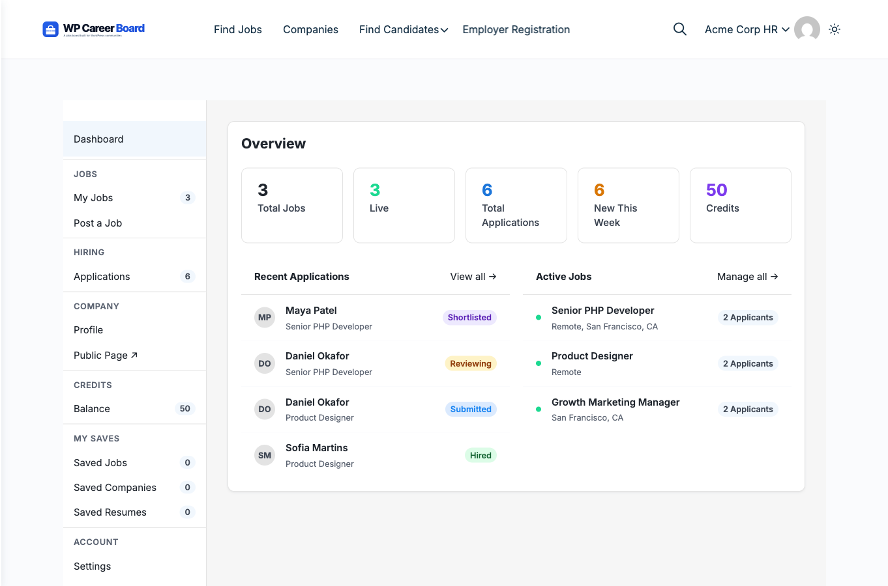

# Credit System (Pro)

> **Pro feature** — Requires WP Career Board Pro.

The Credit System lets you charge employers credits to post jobs. Credits are purchased through your existing e-commerce plugin — WooCommerce, Paid Memberships Pro, MemberPress, or WooCommerce Subscriptions — and deducted automatically when jobs go live.

## How It Works

1. **Admin creates a product** — create a WooCommerce product (or PMPro plan, MemberPress membership) that represents a credit package
2. **Admin maps product to credits** — in Settings → Credits, map that product to a credit amount (e.g., "10 Job Posting Credits" product = 10 credits)
3. **Employer buys credits** — purchases the product through your shop using any payment gateway (Stripe, PayPal, Square, etc.)
4. **Credits added on purchase** — when the order completes, credits are automatically added to the employer's balance
5. **Credits held on submit** — when the employer submits a job, the required credits are reserved
6. **Credits deducted on approval** — when the job goes live, credits are consumed
7. **Refund on rejection** — if the admin rejects a job, held credits are returned

## Credit Ledger

Every transaction is logged in an append-only audit trail:

| Type | Effect |
|---|---|
| **Top-up** | Credits added (from a purchase or manual adjustment) |
| **Hold** | Credits reserved (job submitted, awaiting approval) |
| **Deduct** | Credits consumed (job approved and live) |
| **Refund** | Credits returned (job rejected or cancelled) |

## Supported Payment Providers

WP Career Board Pro uses the **Wbcom Credits SDK** with adapters for each payment provider. The Credits tab automatically detects which plugins are active on your site:

| Provider | Plugin Required | How Credits Are Triggered |
|---|---|---|
| **WooCommerce** | WooCommerce (free) | Order status changes to "completed" |
| **WooCommerce Subscriptions** | WooCommerce Subscriptions | Credits added on each subscription renewal |
| **Paid Memberships Pro** | Paid Memberships Pro | Credits added when a membership level is activated |
| **MemberPress** | MemberPress | Credits added when a membership transaction completes |

You can use any payment gateway supported by your chosen provider — Stripe, PayPal, bank transfer, or anything else the provider supports. WP Career Board does not process payments directly.

## Step 1: Create a Credit Product

### WooCommerce (recommended)

1. Go to **Products → Add New** in wp-admin
2. Set the product name (e.g., "10 Job Posting Credits")
3. Set the product type to **Simple product**
4. Set a price (e.g., $79.00)
5. In the product description, explain what the employer gets
6. Publish the product

Repeat for each credit tier you want to offer:

| Product Name | Price | Credits (mapped in Step 2) |
|---|---|---|
| Starter — 3 Credits | $29 | 3 |
| Growth — 10 Credits | $79 | 10 |
| Agency — 25 Credits | $149 | 25 |

For **WooCommerce Subscriptions**, create a subscription product instead. Credits will be added on each renewal, giving employers a recurring credit allowance.

### Paid Memberships Pro

Create a membership level that represents a credit tier. When an employer activates that membership level, credits are added based on your mapping in Step 2.

### MemberPress

Create a membership that represents a credit tier. When the membership transaction completes, credits are added based on your mapping in Step 2.

## Step 2: Map Products to Credits

1. Go to **WP Career Board → Settings → Credits**
2. Under **Credit Mappings**, click **Add Mapping**
3. Select your WooCommerce product (or PMPro level, MemberPress membership) from the dropdown
4. Enter the number of credits that product should grant
5. Click **Save Changes**

Each product can map to a different credit amount. When an employer purchases that product and the order completes, the mapped number of credits is automatically added to their balance.

## Step 3: Configure Credit Settings

In **WP Career Board → Settings → Credits**, configure:

| Setting | Description |
|---|---|
| **Credits per Job Post** | How many credits are deducted when a job is approved. Set to `0` for free posting. |
| **Low Balance Alert Threshold** | When an employer's balance drops to this number, they see a warning. |
| **Credits Purchase URL** | The URL where employers are sent to buy more credits (typically your WooCommerce shop page or a dedicated credits page). |

### Detected Providers

The bottom of the Credits tab shows **Detected Providers** — a list of which payment plugins are currently active. If a provider is not shown, activate its plugin and refresh the page.

## Employer Experience

Employers see their credit balance in:
- The **Employer Dashboard** header
- The **Confirm & Submit** step of the Job Form

When their balance is too low, they see a "Buy Credits" prompt linking to your configured Credits Purchase URL. The employer completes the purchase through your WooCommerce checkout (or PMPro/MemberPress registration) using whatever payment method you have configured.

### The Hold → Deduct → Refund Cycle

1. **Hold** — When an employer submits a job, the required credits are immediately reserved from their available balance. The employer cannot spend held credits on another job.
2. **Deduct** — When the admin approves the job (or it auto-publishes), the held credits are permanently consumed.
3. **Refund** — If the admin rejects the job, the held credits are returned to the employer's available balance.

This ensures employers are never charged for jobs that don't go live.

## Admin Credit Adjustment

Admins can manually add or deduct credits for any employer:

1. Go to **WP Career Board → Employers**
2. Click the employer's name
3. In the **Credits** section, enter the number of credits to add (or a negative number to deduct)
4. Add an optional note (e.g., "Trial credits" or "Compensation for rejected job")
5. Click **Adjust Credits**

Manual adjustments are recorded in the credit ledger with the admin's note, so there is always a clear audit trail.

## Viewing the Credit Ledger

The full transaction history for any employer is visible from their admin profile — every top-up, hold, deduction, refund, and manual adjustment with timestamps and notes.
