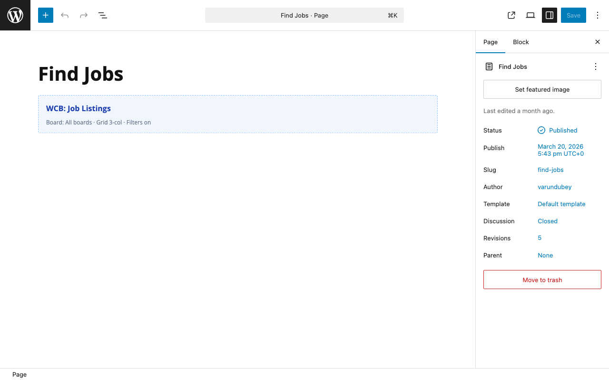

# REST Meta Filters

The `GET /wcb/v1/jobs` REST endpoint accepts postmeta filters via
`?meta_<key>=<value>`. The Job Listings block exposes the same
surface through its `metaFilter` attribute.

## Default-allow rule (1.2.0+)

Any meta key in the `_wcb_*` namespace is allowed by default. The
plugin owns that prefix, so there is no probe risk for fields like
`_wcb_visa_sponsorship`, `_wcb_seniority_score`, `_wcb_department`,
etc. Drop the block in the editor or hit the REST endpoint directly
without any PHP setup:

```
GET /wp-json/wcb/v1/jobs?meta__wcb_visa_sponsorship=1
GET /wp-json/wcb/v1/jobs?meta__wcb_department=engineering
```

```
[wcb_job_listings metaFilter="_wcb_visa_sponsorship:1"]
[wcb_job_listings metaFilter="_wcb_department:engineering"]
```

## Custom (non-WCB) meta still needs opt-in

Custom or third-party meta keys - anything that doesn't start with
`_wcb_` - still need to be added to the `wcb_jobs_allowed_meta_filters`
filter before they can be queried. This prevents anonymous probes
against arbitrary site-internal postmeta (e.g. a private membership
flag set by another plugin):

```php
add_filter( 'wcb_jobs_allowed_meta_filters', function( $keys ) {
    $keys[] = 'partner_company_id';       // not _wcb_*, must opt in
    $keys[] = 'crm_sync_state';           // same
    return $keys;
} );
```

Then anonymous callers can hit:

```
GET /wp-json/wcb/v1/jobs?meta_partner_company_id=42
```

## Why this split?

Without any allowlist, any caller could query against any postmeta - including private fields the plugin or other plugins use for internal
bookkeeping (e.g. `_wcb_employer_banned`, `_wcb_pending_review_token`,
or a membership plugin's `_member_level` field). The pre-1.2.0
behavior required allowlisting every key, which made the common case
(filter jobs by a `_wcb_*` field set by the plugin itself) require
PHP. The 1.2.0 split allows the namespace WCB owns while still gating
foreign meta.

## Block + shortcode integration

The Job Listings block exposes a `metaFilter` attribute on every
shipped surface - Gutenberg inserter, shortcode wrapper, and
page-builder embeds:



If you reference a key that's NOT in the `_wcb_*` namespace and NOT
on the explicit allowlist, the block falls back to showing all jobs
(no error, but the filter is silently ignored) and a
`_doing_it_wrong` notice fires in `WP_DEBUG` mode telling you which
filter to register.

## Matching behavior

Each `meta_<key>=<value>` filter adds one exact-match `meta_query`
clause (`key` + `value`). There is no special `_min` / `_max` suffix
or comma-list expansion - the value you pass is matched verbatim
against the stored postmeta. The dedicated salary range is handled by
the separate `?salary_min=` / `?salary_max=` query parameters, not by
the meta-filter surface.

## Common patterns

### Boolean meta

```php
$keys[] = '_wcb_visa_sponsorship';
$keys[] = '_wcb_relocation_offered';
$keys[] = '_wcb_remote_friendly';
```

These three are already in the `_wcb_*` namespace, so they work
without any allowlist registration. On the front end:

```
?meta__wcb_visa_sponsorship=1
?meta__wcb_relocation_offered=1
```

Register a key with `wcb_jobs_allowed_meta_filters` only when it is
NOT in the `_wcb_*` namespace (a third-party key like
`partner_company_id`).

### Single-value meta

```
?meta__wcb_department=engineering
```

Returns jobs whose `_wcb_department` postmeta equals `engineering`
exactly.

## Performance notes

- All meta filters are added to the WP_Query `meta_query`
  array. WordPress core handles indexing.
- For high-traffic boards, add an index on the relevant rows in
  `wp_postmeta`:
  ```sql
  ALTER TABLE wp_postmeta ADD INDEX wcb_meta_visa (meta_key, meta_value(20));
  ```
- The jobs REST endpoint caches each query result (keyed by the
  query arguments) in a transient for 5 minutes. The TTL is fixed and
  the cache is cleared automatically when a job is saved.

## See also

- [Custom fields filter API](12-custom-fields.md) - declare custom
  fields on the job form so employers can fill them when posting.
- [Page-builder embeds](../for-employers/11-page-builder-embeds.md) -   scope listings via `metaFilter` shortcode attribute.
