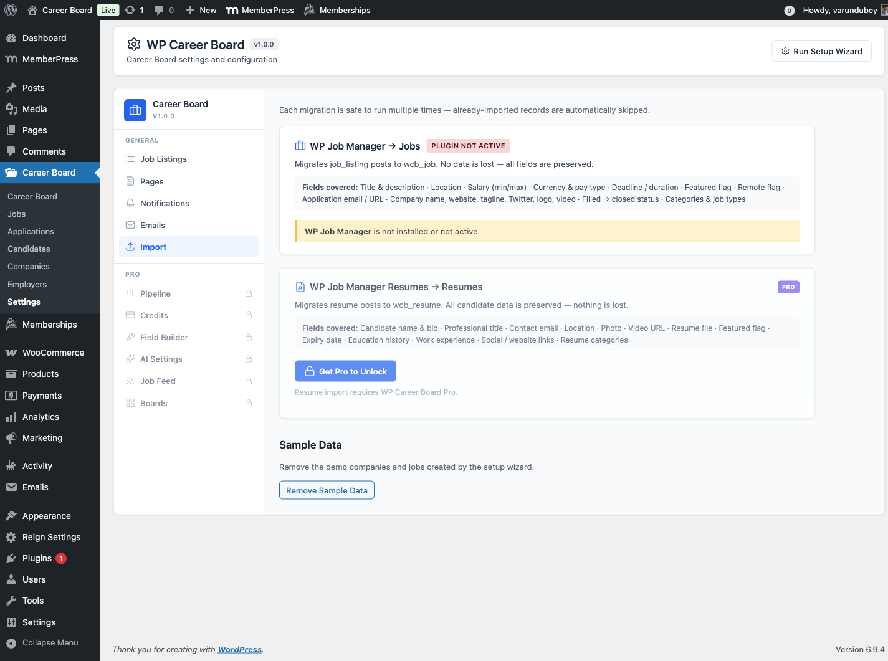

# Import & Migration

WP Career Board includes a built-in migration tool to import jobs and resumes from **WP Job Manager**. Access it from **WP Career Board → Settings → Import**.

## Overview

The importer reads data from WP Job Manager's post types (`job_listing`, `resume`) and creates equivalent WCB records (`wcb_job`, `wcb_resume`). Your original WP Job Manager data is never modified or deleted.

The import uses REST API calls (`POST /wcb/v1/import/run`) batched in groups, with a live progress bar so large imports don't time out.

## Idempotent - Safe to re-run

Every migration checks for an existing WCB record before importing. Records already imported are automatically skipped. You can run the import multiple times without creating duplicates.

## Available migrations

### WP Job Manager → jobs (Free)

Migrates `job_listing` posts to `wcb_job`. Available in the free plugin.

**Fields migrated:**

| WP Job Manager field | WCB equivalent |
|---|---|
| Title & description | Job title + post content |
| `_job_location` | `_wcb_location` + location taxonomy |
| `_job_salary` | `_wcb_salary_min` / `_wcb_salary_max` |
| Salary currency | `_wcb_salary_currency` |
| Pay unit HOUR / MONTH / YEAR | Hourly / monthly / yearly (DAY and WEEK are left unset and show as yearly) |
| `_job_expires` / `_job_duration` | `_wcb_deadline` |
| `_featured` | `_wcb_featured` |
| `_remote_position` | `_wcb_remote` |
| `_application` (email or URL) | Preserved as application meta |
| `_company_name`, `_company_website`, `_company_tagline`, `_company_twitter`, logo | A company page, linked to the job. An existing company with the same website (or name) is reused, so a company's jobs share one page. An employer with no company adopts it. |
| Filled job | Imported as **Closed** (not live) |
| Expired job (when importing expired jobs) | Imported as **Expired** |
| Categories, job types, tags | `wcb_category`, `wcb_job_type`, `wcb_tag` |

**How to run:**

1. Go to **WP Career Board → Settings → Import**
2. The card shows how many WP Job Manager jobs were found and how many are already imported, plus a preview: how many filled jobs will be closed, how many company pages will be created and how many applications wait to be imported
3. Click **Import All Jobs**
4. A progress bar shows batch-by-batch progress until complete

WP Job Manager does not need to remain active after the import is complete.

From the command line, `wp wcb migrate wpjm --dry-run` prints the same preview without writing anything.

### WP Job Manager applications → applications (Free)

When the WP Job Manager Applications add-on is active, a second card moves its applications onto the imported jobs. Import the jobs first.

| WP Job Manager Applications | WP Career Board |
|---|---|
| Status new / interviewed / offer / hired / rejected / archived | Submitted / Shortlisted / Shortlisted / Hired / Rejected / Rejected |
| Candidate name and email | The candidate's account when the email matches a member, else a guest application |
| Message | Cover letter |
| Attached files | Listed as links in the cover letter (files stay where WP Job Manager stored them) |

No emails are sent to candidates or employers during the import. Command line: `wp wcb migrate wpjm-applications [--dry-run]`.

### WP Job Manager resumes → resumes (Pro)

> **Pro feature** - Requires WP Career Board Pro.

Migrates `resume` posts to `wcb_resume`. Only available when WP Career Board Pro is active.

**Fields migrated:**

| WP Job Manager Resumes field | WCB equivalent |
|---|---|
| Candidate name & bio | Resume title + summary |
| Professional title | Resume headline |
| Contact email | Candidate email |
| Location | Resume location |
| Photo | Candidate avatar |
| Video URL | Resume video link |
| Resume file attachment | Attached file |
| `_featured` | Featured flag |
| `_resume_expires` | Expiry date |
| Education history | Education section entries |
| Work experience | Work Experience section entries |
| Social / website links | Links section entries |
| `resume_category` | Resume categories |

**How to run:**

1. Go to **WP Career Board → Settings → Import**
2. The WP Job Manager Resumes card is shown when Pro is active
3. Click **Import All Resumes**
4. Monitor the progress bar until complete

## What happens with duplicates

Each import run checks whether a WCB record already exists for a given WP Job Manager post ID (tracked via the `_wcb_migrated_from` meta key). If it does, that record is skipped and counted as "already imported" - not re-imported or overwritten.

## Progress display

The Import page shows live stats for each migration:

| Stat | Meaning |
|---|---|
| **Found** | Total records in WP Job Manager |
| **Already imported** | Records already migrated to WCB |
| **Remaining** | Records that will be processed on the next run |

## After importing

1. Go to **WP Career Board → Jobs** to review imported jobs - check statuses and verify key fields
2. Go to **WP Career Board → Settings → Pages** and confirm page assignments are correct
3. Flush your permalink structure via **Settings → Permalinks → Save Changes**
4. If WP Job Manager had categories or job types that don't map cleanly, review them in **WP Career Board → Job Categories** and **WP Career Board → Job Types**

## Limitations

- Custom fields added by WP Job Manager extensions are not automatically mapped - you will need to re-enter those manually
- The importer does not delete WP Job Manager data after migration - you can deactivate and delete WP Job Manager separately once you are satisfied with the results
