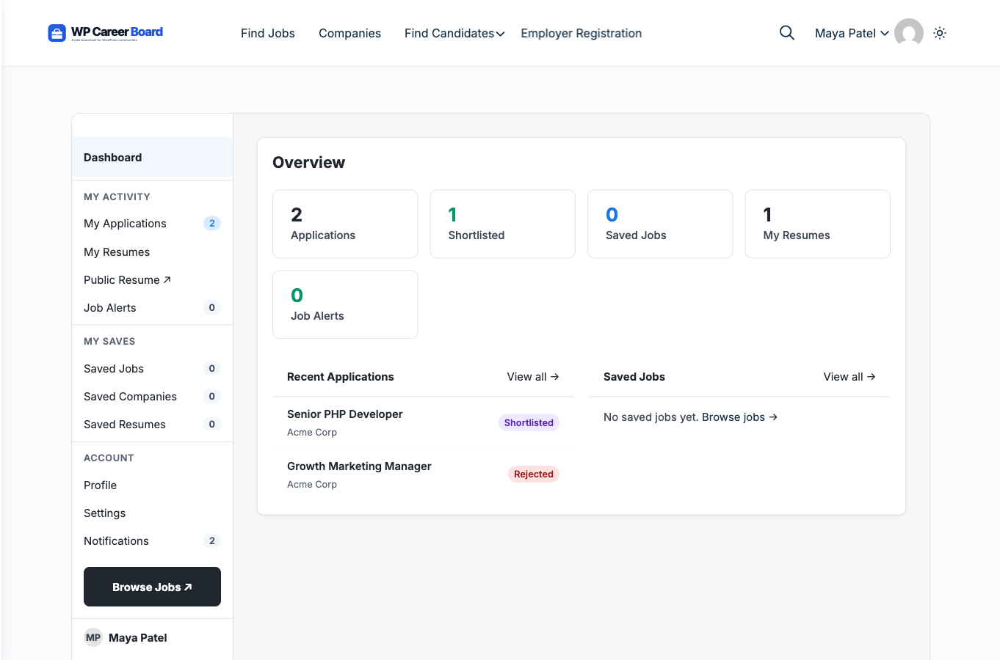

# Candidate Overview

Candidates are job seekers who browse listings and apply on your job board. They get a personal dashboard to manage all their activity in one place.

## What Candidates Can Do

- Browse and search job listings
- Filter jobs by category, type, location, and experience level
- Bookmark jobs to review and apply later
- Apply for jobs with a cover letter and resume upload (PDF/DOC)
- Track all applications and their statuses from a single dashboard
- Receive email notifications when their application status changes
- Set up **job alerts** to get notified when matching jobs are posted (Pro)

## Registration

Visit the **Employer Registration** page (which despite its name handles both roles) and choose **"Find a Job"** to register as a candidate. The heading on the registration block is "Join WP Career Board". You'll need:
- First name and last name
- Email address
- Password (minimum 8 characters)

After registration, you're automatically logged in and redirected to your Candidate Dashboard.

> Employers choose **"Hire Talent"** on the same page — one unified registration form for both roles.

## The Candidate Role

When a user registers as a candidate, they get the **Candidate** role. This gives access to:

- The **Candidate Dashboard** — applications, saved jobs, resumes, job alerts
- The ability to apply for jobs
- The saved jobs (bookmarks) list
- **Job Alerts** management (Pro)

Admins can manually assign the Candidate role from **Users → Edit User** in wp-admin.

## Guest Applications

Candidates can apply without creating an account. Guest applicants provide their name and email during the application. They receive email updates but do not have a dashboard.

> **Tip for your users:** Creating an account gives candidates the ability to track all applications, save jobs, and build a profile. Encourage registration.

## Section Contents

- [Finding Jobs](./02-finding-jobs.md) — searching, filtering, and browsing listings
- [Applying for Jobs](./03-applying-for-jobs.md) — the application process step by step
- [My Applications](./04-my-applications.md) — tracking application statuses
- [Saved Jobs](./05-saved-jobs.md) — bookmarking jobs for later
- [Resume Builder](./06-resume-builder.md) — creating and managing resumes (Pro)
- [Job Alerts](./07-job-alerts.md) — getting notified about matching jobs (Pro)
