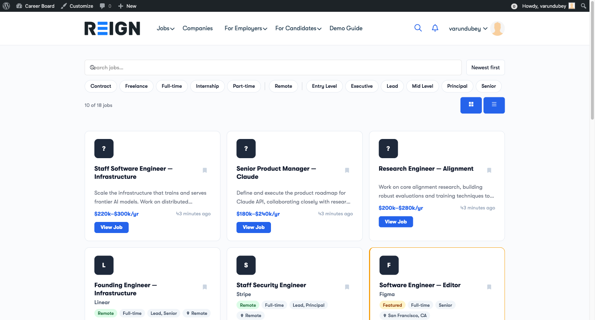
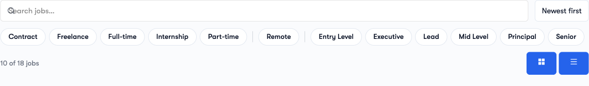
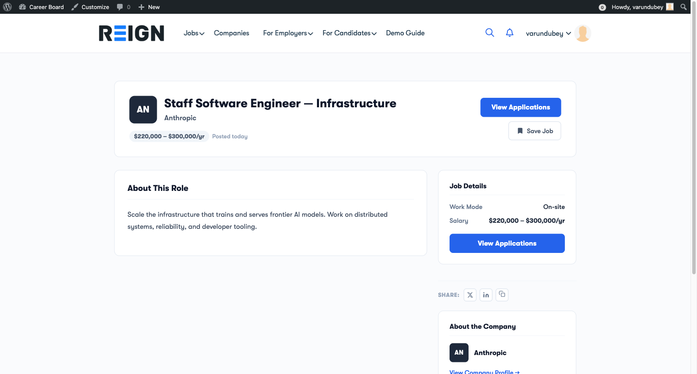

# Finding Jobs

The job board gives candidates a fast, reactive way to browse and narrow down listings - no page reloads, no waiting.

## Browsing the Job Board

Visit the **Jobs** page on your site. You will see a grid of all currently active job listings, each showing:

- Job title
- Company name and logo
- Location
- Job type (Full-time, Part-time, etc.)
- Posted date
- Salary (if provided by the employer)

Click any card to open the full job detail page.

## Searching by Keyword

Use the **Search** bar at the top of the job board to find jobs by keyword. The search looks through job titles and descriptions. Results update as you type.

## Filtering Jobs

Use the **Filter** dropdowns to narrow results by:

| Filter | Options |
|---|---|
| **Category** | Industry or function (e.g., Engineering, Marketing, Design) |
| **Job Type** | Full-time, Part-time, Contract, Freelance, Internship |
| **Location** | Country, state, or city |
| **Experience Level** | Entry, Mid, Senior, Lead, Executive |
| **Salary Range** | A dual-handle slider to set a minimum and maximum pay. See [Salary Range Filter](./08-salary-filter.md). |

You can combine multiple filters. Results update instantly after each selection.

To remove all filters at once, click **Clear all** in the filter bar.

## Loading More Jobs

The job board loads a set number of jobs at a time (set by your admin). When you reach the bottom, click **Load more** to see additional listings.

## Viewing a Job

Click any job card to open the full detail page. You will see:

- Full job description
- Company information with a link to the company profile
- Application deadline (if set)
- Salary range
- Job type, location, and experience level
- An **Apply Now** button to start the application

## Recommended for You (Pro)

When the site runs WP Career Board Pro with AI matching enabled, your **Candidate Dashboard → Overview** shows a **Recommended for you** list - jobs matched to the resume on your profile, labelled "AI-matched to your resume". This is in addition to browsing and searching the full board. The recommendations are hidden on Free-only installs and when AI matching is not configured.

## Saving a Job for Later

Click the **bookmark icon** on any job card or job detail page to save it. Saved jobs appear in your **Candidate Dashboard → Saved Jobs** tab. Bookmarking works for any logged-in user (a dedicated Candidate role is not required).

You can remove a saved job at any time from the dashboard. You can also bookmark companies - those appear under **Candidate Dashboard → Saved Companies**.
