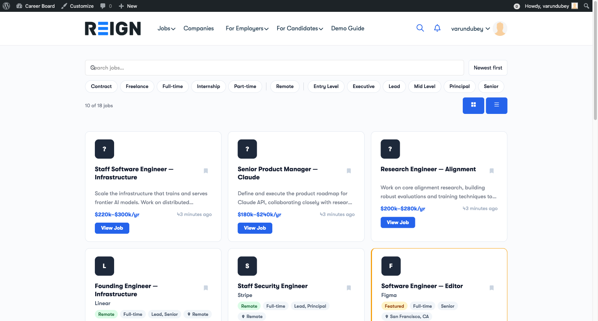
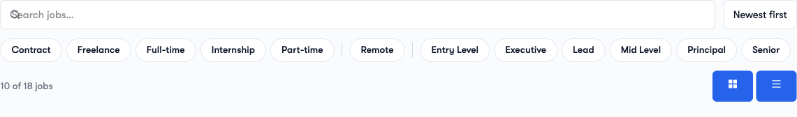
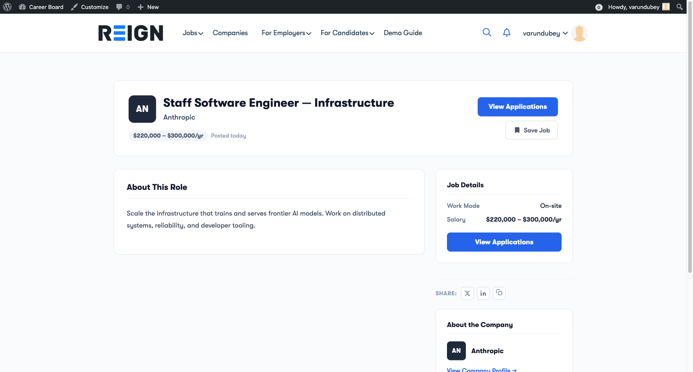

# Finding Jobs

The job board gives candidates a fast, reactive way to browse and narrow down listings - no page reloads, no waiting.

## Browsing the job board

Visit the **Find Jobs** page on your site (`/find-jobs/`). You will see a grid of all jobs that are currently taking applications, featured jobs first, each showing:

- Job title
- Company name and logo
- Location
- Job type (Full-time, Part-time, etc.)
- Posted date
- Salary (if provided by the employer)

Click any card to open the full job detail page.

## Searching by keyword

Use the **Search** bar at the top of the job board to find jobs by keyword. The search looks through job titles, descriptions and company names. Every word you type must appear (up to six words; words of one letter are ignored), and jobs with the words in the title come first. Featured jobs lead the results. Results update without a page reload.

## Filtering jobs

Use the **Filter** dropdowns to narrow results by:

| Filter | Options |
|---|---|
| **Category** | Industry or function (e.g., Engineering, Marketing, Design) |
| **Job Type** | Full-time, Part-time, Contract, Freelance, Internship |
| **Location** | Country, state, or city |
| **Experience Level** | Entry, Mid, Senior, Lead, Executive |
| **Salary Range** | Sliders to set a minimum and maximum pay. See [Salary Range Filter](./08-salary-filter.md). |
| **Remote only** | Only jobs marked remote |

You can pick several values in one filter (for example two job types) and combine filters. A job matches if it has any of the values you picked in a filter, and all of the filters together. Results update instantly after each selection, and each active filter shows as a removable pill above the results. Links shared with filters in the address bar open with those filters already applied.

To remove all filters at once, click **Clear all**. On tablets and phones the filters collapse behind a **Filters** button that shows how many are active.

## Sorting

Use the **Sort jobs** menu above the results: **Recommended** (best match while you are searching, otherwise the site's default order), **Newest first**, **Closing soonest** (jobs already past their deadline come last), **Highest salary** (compared per year) or **Oldest first**.

## Loading more jobs

The job board loads a set number of jobs at a time (set by your admin). When you reach the bottom, click **Load more** to see additional listings.

## Browsing by category, type, tag, location or experience

Clicking a category, job type, tag, location or experience level on a job opens a page that lists only the jobs with that term, titled with the term's name. The filters and Load more on that page stay within the term.

## Viewing a job

Click any job card to open the full detail page. You will see:

- Full job description
- Company information with a link to the company profile
- Application deadline (if set). A job past its deadline shows a notice that it has expired, with similar open jobs, and no **Apply** button
- Salary range
- Job type, location, and experience level
- An **Apply Now** button to start the application

## Recommended for you (Pro)

When the site runs WP Career Board Pro with AI matching enabled, your **Candidate Dashboard → Overview** shows a **Recommended for you** list - jobs matched to the resume on your profile, labelled "AI-matched to your resume". This is in addition to browsing and searching the full board. The recommendations are hidden on Free-only installs and when AI matching is not configured.

## Saving a job for later

Click the **bookmark icon** on any job card or job detail page to save it. Saved jobs appear in your **Candidate Dashboard → Saved Jobs** tab. Bookmarking works for any logged-in user (a dedicated Candidate role is not required).

You can remove a saved job at any time from the dashboard. You can also bookmark companies - those appear under **Candidate Dashboard → Saved Companies**.
