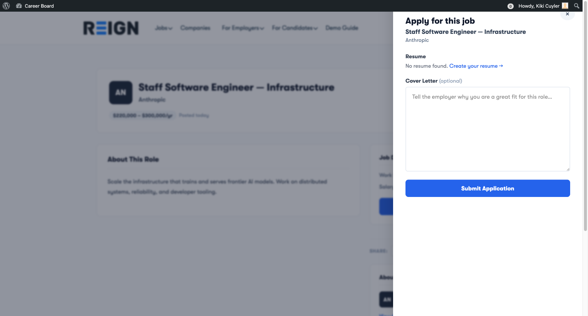

# Applying for Jobs

Applying is quick — candidates fill out a short form that slides in from the right side of the job listing page. No redirects, no new pages.

## Before You Apply

You can apply as a **guest** (no account required) or as a **registered candidate**.

Registered candidates get:
- A dashboard to track all their applications
- Saved application history
- Email updates on every status change

## How to Apply

1. Open a job listing page
2. Click **Apply Now** — an application panel slides in from the right
3. Fill in the form fields
4. Click **Submit Application**

### Application Form Fields

| Field | Requirement |
|---|---|
| **Full Name** | Required (pre-filled if logged in) |
| **Email Address** | Required (pre-filled if logged in) |
| **Cover Letter** | Optional — but strongly recommended |
| **Attach Resume** | Shown if the employer requires it |

> **With WP Career Board Pro:** candidates can attach resumes they built inside the platform, and employers can add custom screening questions to each job.

## What Happens After You Apply

1. You receive a **confirmation email** with the job title and company name
2. The employer receives a **notification email** about your application
3. Your application appears in your **Candidate Dashboard → My Applications** with status **Submitted**

## Withdrawing an Application

If you change your mind:

1. Go to your **Candidate Dashboard → My Applications**
2. Find the application you want to withdraw
3. Click **Withdraw**

The employer will see your application marked as Withdrawn. You cannot resubmit after withdrawing.

## Application Limits

There is no limit to how many jobs a candidate can apply for on the free version.

## Applying Without an Account

Guest applicants (no account):
- Enter their name and email in the application form
- Receive email confirmation
- Cannot track their application status (no dashboard access)
- Cannot withdraw their application

To track your application status, [register as a candidate](./01-overview.md) before applying.
