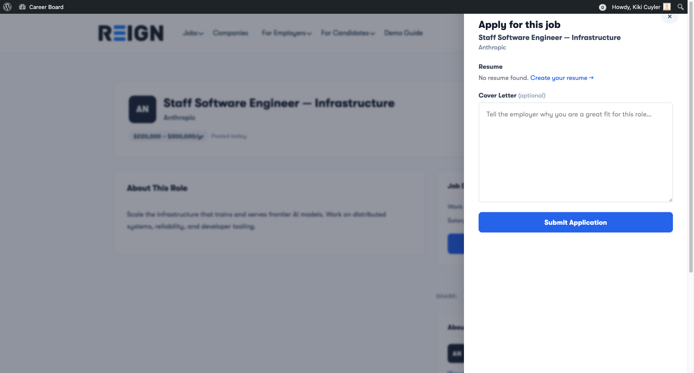

# Applying for Jobs

Applying is quick - candidates fill out a short form that slides in from the right side of the job listing page. No redirects, no new pages.

## Before you apply

You can apply as a **guest** (no account required) or as a **logged-in member**. By default any logged-in user can apply - a dedicated Candidate role is not required unless the site admin turns on **Require Candidate Role**. Some sites also turn on **Require login to apply**; then the job page shows **Sign in to apply** instead of the form. Members who post jobs (employers) cannot apply, and nobody can apply to their own job.

Logged-in members get:
- A dashboard to track all their applications
- Saved application history
- Email updates on every status change

## How to apply

1. Open a job listing page
2. Click **Apply Now** - an application panel slides in from the right
3. Fill in the form fields
4. Click **Submit Application**

### Application form fields

| Field | Requirement |
|---|---|
| **Full Name** | Required (pre-filled if logged in) |
| **Email Address** | Required (pre-filled if logged in) |
| **Cover Letter** | Optional by default - but strongly recommended |
| **Screening questions** | Shown when the employer added questions to the job. Required ones must be answered |
| **Select Resume** | Choose from your saved resumes (Pro) |
| **Upload Resume** | Upload a PDF, DOC, or DOCX file. Default size limit is 5 MB; the site admin can raise it up to 20 MB. A resume is required to apply unless the admin turns that off. |

When Pro is active, you'll see both options: pick an existing resume from your profile **or** upload a file directly. The " - or upload a file - " divider separates the two methods. If you pick a resume that was built in the Resume Builder and has no uploaded PDF, Pro generates and attaches a PDF for you automatically on submit.

### Write your cover letter with AI (Pro)

When the site runs WP Career Board Pro with AI enabled, a **Write with AI** button appears next to the Cover Letter field. Click it to have the assistant draft a cover letter based on the job and your profile, then edit the text before submitting. The button is hidden on Free-only installs and when AI is not configured.

> **With WP Career Board Pro:** employers can add custom screening questions to each job. Answers to required questions are checked before your application is accepted.

## What happens after you apply

1. You receive a **confirmation email** with the job title and company name
2. The employer receives a **notification email** about your application. If the site uses an AI screening tool, a short notice above **Submit Application** says so
3. Your application appears in your **Candidate Dashboard → My Applications** with status **Submitted**
4. **Get notified about similar jobs** - after submitting, you'll see a prompt to create a job alert based on this job's category, type, and location (Pro feature)

## Withdrawing an application

If you change your mind:

1. Go to your **Candidate Dashboard → My Applications**
2. Find the application you want to withdraw
3. Click **Withdraw**

Withdrawing keeps the application in your list marked **Withdrawn**, and the employer gets an email so they stop reviewing it. You can withdraw until the employer hires or declines you. After withdrawing you can apply to the same job again.

> **Note for site owners:** the Withdraw control is on by default and can be turned off under **Career Board → Settings → Applications → Allow Withdraw**. When it is off, candidates can no longer withdraw their own applications.

## Application limits

There is no limit to how many jobs a candidate can apply for on the free version.

## Applying without an account

Guest applicants (no account):
- Enter their name and email in the application form
- Receive email confirmation
- Receive status emails, including a "not selected" email, but cannot track their application in a dashboard
- Cannot withdraw their application
- Are limited to 10 applications an hour from one connection

To track your application status, [register as a candidate](./01-overview.md) before applying.
