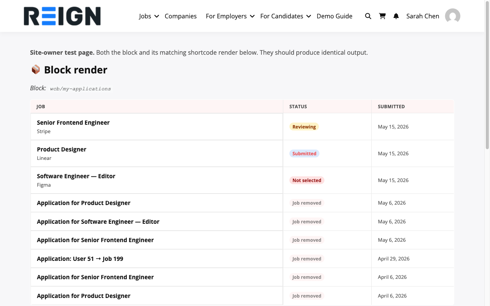

# My Applications

The **My Applications** tab in the Candidate Dashboard shows every job you have applied for and its current status.

## Accessing My Applications

1. Go to the **Candidate Dashboard** page
2. The **My Applications** tab is active by default
3. You will see all your applications listed newest first

## Table format (1.2.0+)

Starting with 1.2.0, the block and its matching shortcode (`[wcbp_my_applications]`) render as a semantic table with column headers, so the data is screen-reader friendly and copy/paste-able into a spreadsheet without losing structure:

| Column | What it shows |
|---|---|
| **Job** | Job title (linked to the listing) and company name |
| **Status** | Coloured status badge — see the table below for each badge's meaning |
| **Submitted** | Application date in your site's date format |

On narrow viewports (under 480px container width) the table collapses to a card layout — each row's cells stack vertically with their column label in-place, so phones get the same data without a horizontal scrollbar.

## What You See per Application

Each row shows:

- **Job title** and company name
- **Application date**
- **Current status** — updated by the employer
- A link to view the original job listing

## Application Statuses

| Status | What It Means |
|---|---|
| **Submitted** | Your application was received; the employer hasn't reviewed it yet |
| **Reviewing** | The employer is actively looking at your application |
| **Shortlisted** | You're being considered — the employer is interested |
| **Rejected** | The employer is no longer considering your application |
| **Hired** | Congratulations — you got the job |

> **Status updates:** You will receive an email notification whenever your application status changes.

## Withdrawing an Application

To withdraw from a role you are no longer interested in:

1. Find the application in the list
2. Click the **Withdraw** button
3. Confirm in the prompt

Withdrawing permanently deletes the application. It is removed from both your dashboard and the employer's view. You cannot resubmit after withdrawing.

## Overview Panel

The **Overview** tab at the top of the dashboard shows a summary of your recent activity:

- Total applications submitted
- Number of shortlisted applications
- 4 most recent applications
- Recently saved jobs

This gives you a quick snapshot without switching between tabs.
