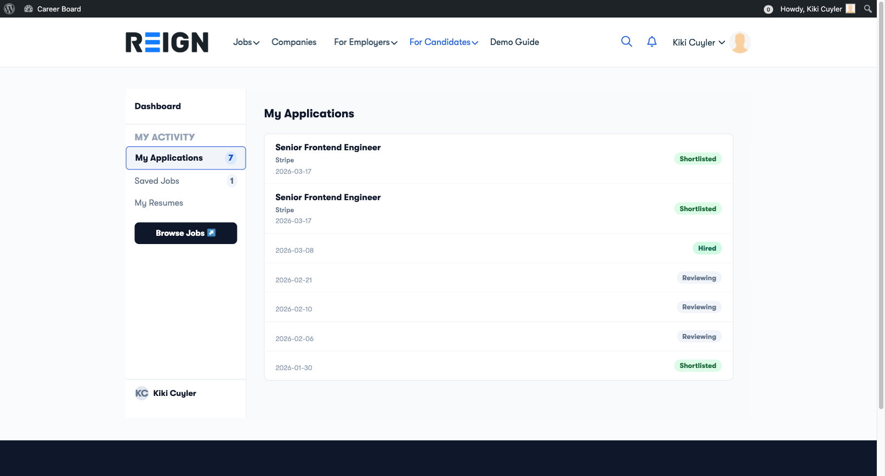

# My Applications

The **My Applications** tab in the Candidate Dashboard shows every job you have applied for and its current status.

## Accessing My Applications

1. Go to the **Candidate Dashboard** page
2. The **My Applications** tab is active by default
3. You will see all your applications listed newest first

## What You See per Application

Each application card shows:

- **Job title** and company name
- **Application date**
- **Current status** — updated by the employer
- A link to view the original job listing

## Application Statuses

| Status | What It Means |
|---|---|
| **Submitted** | Your application was received; the employer hasn't reviewed it yet |
| **Reviewed** | The employer has looked at your application |
| **Shortlisted** | You're being considered — the employer is interested |
| **Closed** | The employer is no longer considering your application |
| **Withdrawn** | You withdrew your application |

> **Status updates:** You will receive an email notification whenever your application status changes.

## Withdrawing an Application

To withdraw from a role you are no longer interested in:

1. Find the application in the list
2. Click the **Withdraw** button
3. Confirm in the prompt

Once withdrawn, you cannot resubmit. The employer will see the application marked as Withdrawn.

## Overview Panel

The **Overview** tab at the top of the dashboard shows a summary of your recent activity:

- Total applications submitted
- Number of shortlisted applications
- 4 most recent applications
- Recently saved jobs

This gives you a quick snapshot without switching between tabs.
