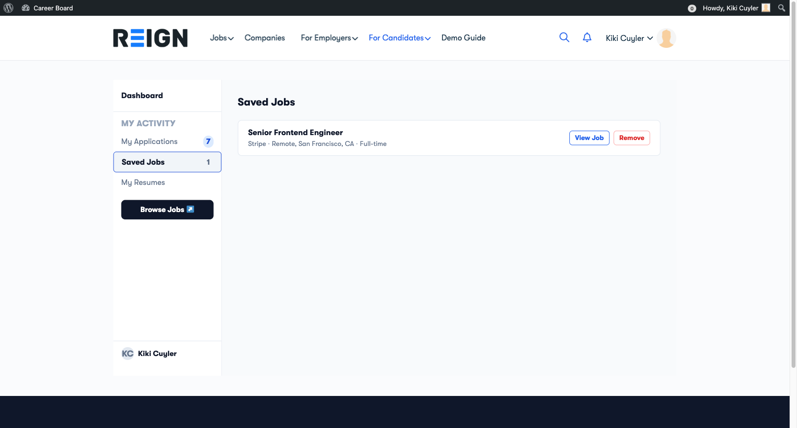

# Saved Jobs

Save any job listing to your personal list so you can come back to apply when ready.

## Saving a Job

You can bookmark a job from two places:

**From the job listings grid:**
- Click the **bookmark icon** in the top-right corner of any job card

**From the job detail page:**
- Click the **Save Job** button on the listing page

Both require you to be logged in as a candidate. If you are not logged in, clicking the bookmark will prompt you to register or log in.

## Viewing Your Saved Jobs

1. Open the **Candidate Dashboard**
2. Click the **Saved Jobs** tab

You will see all your bookmarked jobs listed with:
- Job title and company name
- Location and job type
- Date saved
- A **Remove** button

## Removing a Saved Job

Click **Remove** on any saved job to delete it from your list. This does not affect any application you may have already submitted.

## Applying from Saved Jobs

Saved jobs include a direct **Apply Now** link so you can apply without going back to the main listings page.

> **Tip:** Use Saved Jobs as your personal shortlist. Browse the board first, bookmark the ones that interest you, then review your list and apply to the best matches.

## Limit

There is no limit to how many jobs you can save.
