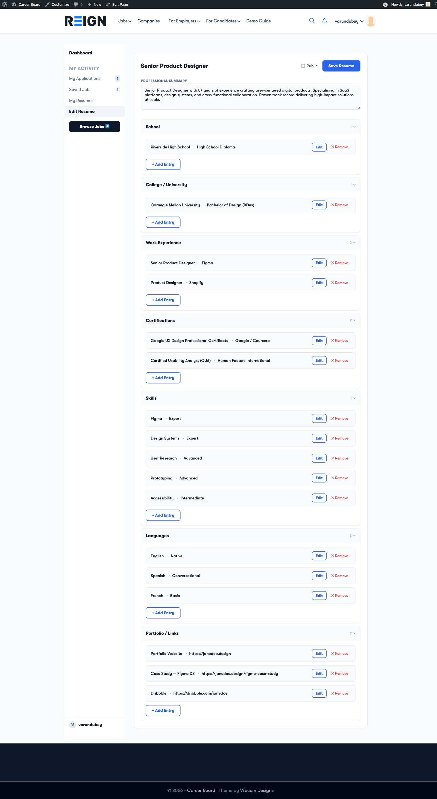
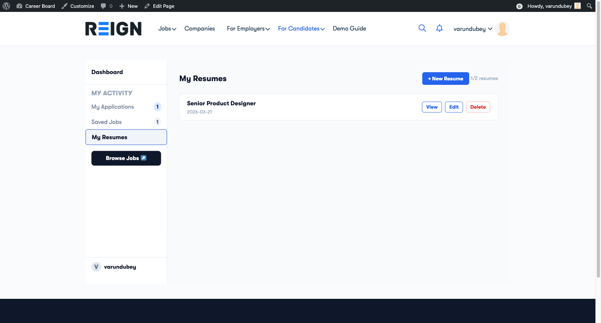
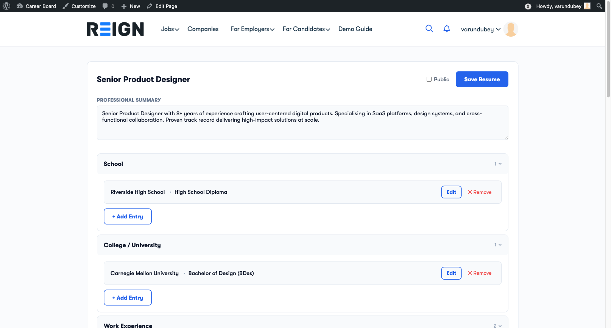

# Resume Builder

> **Pro feature** — Requires WP Career Board Pro.

The Resume Builder lets candidates create structured, multi-section resumes directly on your WordPress site — no PDF uploads, no external tools required.

## What Candidates Can Build

A resume is made up of sections. Each section holds structured entries:

| Section | What it stores |
|---|---|
| **Professional Summary** | A free-text overview paragraph |
| **Work Experience** | Job title, company, dates, description |
| **Education** | Degree, institution, dates |
| **Skills** | Skill name and optional proficiency level |
| **Languages** | Language name and proficiency |
| **Certifications** | Certificate name, issuing body, date |
| **Links** | Portfolio, GitHub, LinkedIn, etc. |

## Admin Setup

Before candidates can use the Resume Builder, set it up in two steps:

1. Create a page and add the **Resume Builder** block to it
2. Go to **WP Career Board → Settings → Pages** and assign that page to the **Resume Builder Page** field

Once assigned, the Candidate Dashboard's **My Resumes** tab will link to this page automatically.

## My Resumes Tab

Candidates access their resumes from **Candidate Dashboard → My Resumes**.

From this tab, candidates can:
- See all saved resumes with their last-updated date
- Click **Edit** to open a resume in the builder
- Click **Create New Resume** to start a new one
- Click **Delete** to permanently remove a resume

## Using the Resume Builder

The builder is organized into collapsible sections. Click any section header to expand it.

### Adding Entries

1. Open any section (e.g., Work Experience)
2. Click **+ Add Entry**
3. Fill in the fields
4. Click **Save** on the entry

The entry appears as a compact row. Click it to expand and edit again.

### Entry Fields

**Work Experience:** Job Title, Company, Start Date, End Date, "Currently working here" toggle, Description

**Education:** Degree / Qualification, Institution, Start Year, End Year, Field of Study

**Skills:** Skill name, Proficiency level (Beginner / Intermediate / Advanced / Expert)

**Languages:** Language name, Proficiency (Native / Fluent / Conversational)

**Certifications:** Certificate name, Issuing organization, Issue date

**Links:** URL, Label (e.g., "Portfolio", "GitHub")

### Auto-Save

The Resume Builder saves each entry individually when you click **Save** on that entry. There is no global save button. A "Saved" confirmation briefly appears after each save.

## Multiple Resumes

Candidates can create more than one resume — for example, one for engineering roles and one for management roles. The dashboard lists all resumes with their last-updated date.

## Attaching a Resume to an Application

When a candidate applies for a job, they can select one of their saved resumes to attach. The employer sees the full structured resume on the application — not a PDF attachment.

## Resume Visibility

- **Private** (default) — visible only to the candidate and employers who receive applications from them
- **Public** — visible in the Find Resumes employer archive

Candidates toggle visibility in the Resume Builder header.
