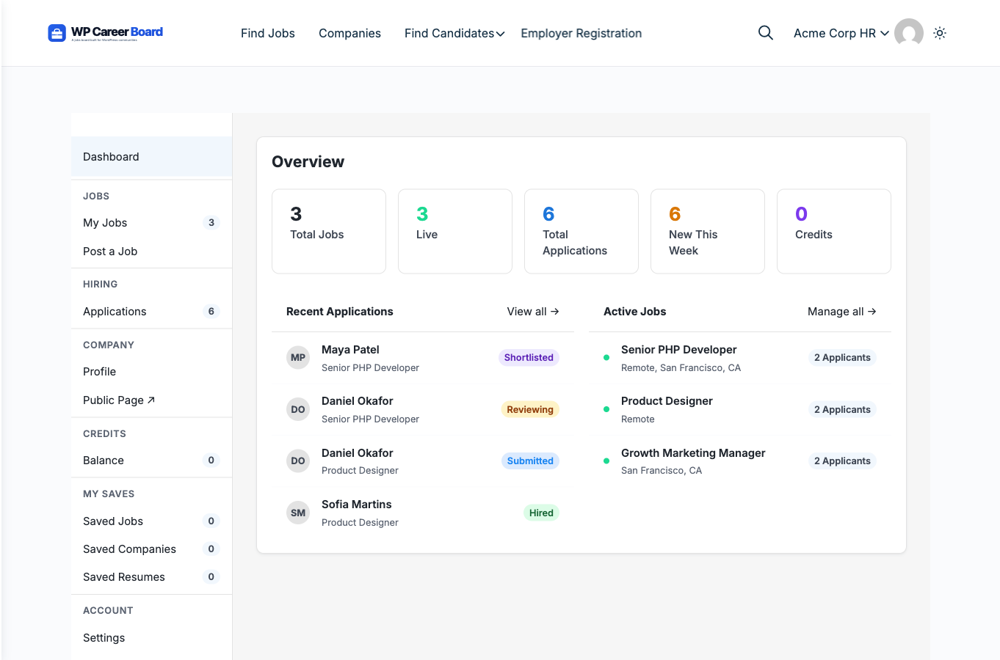

# Employer Overview

Employers are businesses or individuals who post jobs and manage applications on your job board. This section covers everything an employer can do.

## What Employers Can Do

- Register an account with the Employer role
- Post new jobs using a guided multi-step form
- Manage all their job listings (edit, close, re-open, publish)
- Review and filter incoming applications
- Set up and edit a public company profile
- Receive email notifications for new applications

## The Employer Role

When a user registers as an employer, they get the **Employer** role. This gives them access to:

- The **Job Form** (post new jobs)
- The **Employer Dashboard**
- Their own company profile

Admins can also manually assign the Employer role to any user from **Users → Edit User** in wp-admin.

## How Applications Reach Employers

When a candidate applies to a job, the employer sees the application immediately in their dashboard. They get:

- Applicant name and email
- Application status (Submitted / Reviewing / Shortlisted / Rejected / Hired / Withdrawn)
- Submission date
- A direct link to the applicant's profile (if they are a registered candidate)

## Section Contents

- [Post a Job](./02-post-a-job.md) — step-by-step guide to submitting a new job listing
- [Manage Jobs](./03-manage-jobs.md) — editing, closing, and re-opening jobs
- [Review Applications](./04-review-applications.md) — working through the applicant list
- [Company Profile](./05-company-profile.md) — setting up the public employer page
- [Application Pipeline](./06-application-pipeline.md) — Kanban ATS workflow (Pro)
- [Find Resumes](./07-find-resumes.md) — browsing the candidate resume archive (Pro)
