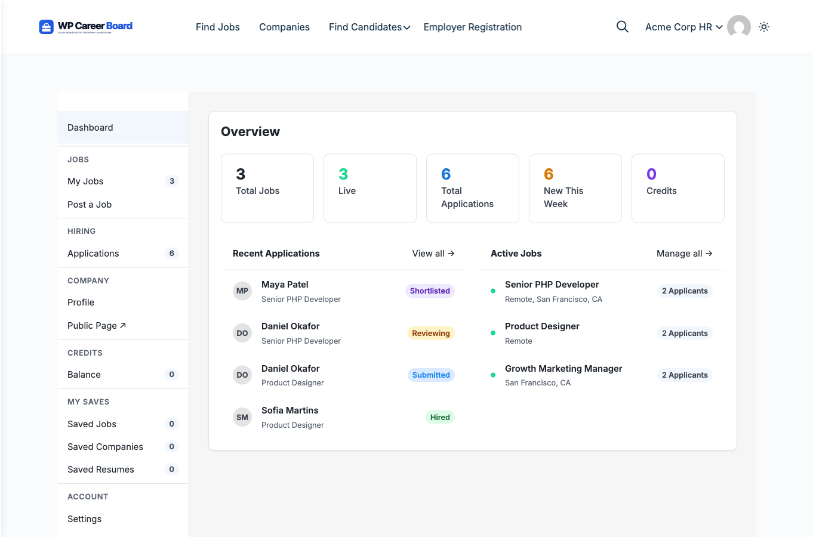

# Employer Overview

Employers are businesses or individuals who post jobs and manage applications on your job board. This section covers everything an employer can do.

## What employers can do

- Register an account with the Employer role
- Post new jobs using a guided multi-step form, or a single-page form
- Manage all their job listings (edit, close, reopen, resubmit, feature)
- Review applications in a list or a Board (Kanban) view, rate applicants and keep private team notes
- Export a job's applicants to CSV
- Set up and edit a public company profile with a live preview
- Bookmark jobs, companies, and candidate resumes
- Update their own display name, email, and password from the dashboard, and choose which optional emails they receive
- Receive email notifications for new applications, withdrawals and jobs about to end

## The employer role

When a user registers as an employer, they get the **Employer** role. This gives them access to the **Employer Dashboard**, a single-page app with a left sidebar. Admins can also assign the Employer role to any user from **Users → Edit User** in wp-admin.

At the top of the sidebar is your identity: your avatar (or company logo), name, and "Employer · Company name". Click it to open your company profile. Below it:

- **Overview** - stat tiles (Total Jobs, Live, Total Applications, New This Week) and your recent applications and active jobs
- **Jobs**
  - **My Jobs** - manage all job listings (the badge shows your total)
  - **Post a Job** - submit a new job using the multi-step form
- **Hiring**
  - **Applications** - review applicants in List or Board view (the badge shows your total)
- **Company**
  - **Profile** - set up the public employer page
  - **Public Page** - opens your live company page in a new tab
- **Credits** (only when the Credit System is on, needs Pro) - your balance, buying credits, receipts and history
- **Saved** - Saved Jobs, Saved Companies, and Saved Resumes (Saved Resumes appears only when Pro's resume feature is active)
- **Account**
  - **Settings** - display name, email, password, and optional email preferences
  - **Notifications** - appears when the in-dashboard notification bell is enabled (Pro)

A **+ Post a Job** button stays pinned at the bottom of the sidebar. On tablets and phones the sidebar collapses behind a menu button that shows the current section.

## How applications reach employers

When a candidate applies to a job, the employer sees the application in the dashboard and gets an email. Each application shows:

- Applicant name and email
- Application status (Submitted, Reviewing, Shortlisted, Rejected, Hired, and Withdrawn or Closed when they apply)
- Submission date
- A link to the applicant's profile, if they are a registered candidate

## Section contents

- [Post a Job](./02-post-a-job.md) - step-by-step guide to submitting a new job listing
- [Manage Jobs](./03-manage-jobs.md) - editing, closing, and re-opening jobs
- [Review Applications](./04-review-applications.md) - working through the applicant list
- [Company Profile](./05-company-profile.md) - setting up the public employer page
- [Application Pipeline](./06-application-pipeline.md) - the custom stage pipeline (Pro)
- [Find Resumes](./07-find-resumes.md) - browsing the candidate resume archive (Pro)
- [Quick Job Form](./08-quick-job-form.md) - the single-page job form
- [Applicant CSV Export](./09-csv-export.md) - exporting applicants from your dashboard or wp-admin
- [Your Credit Balance](./10-employer-credit-balance.md) - credits, when the Credit System is on
- [Page-builder Embeds](./11-page-builder-embeds.md) - shortcodes for Elementor, Divi, Bricks, and more
- [Troubleshooting](./12-troubleshooting.md) - common employer questions
