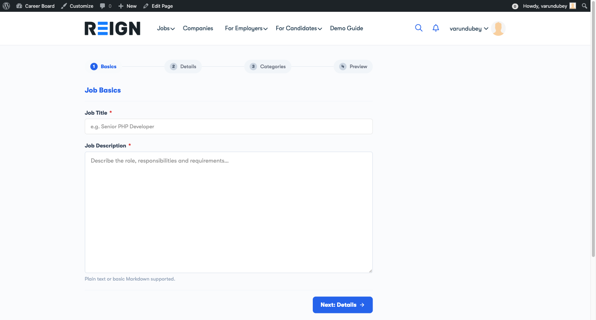
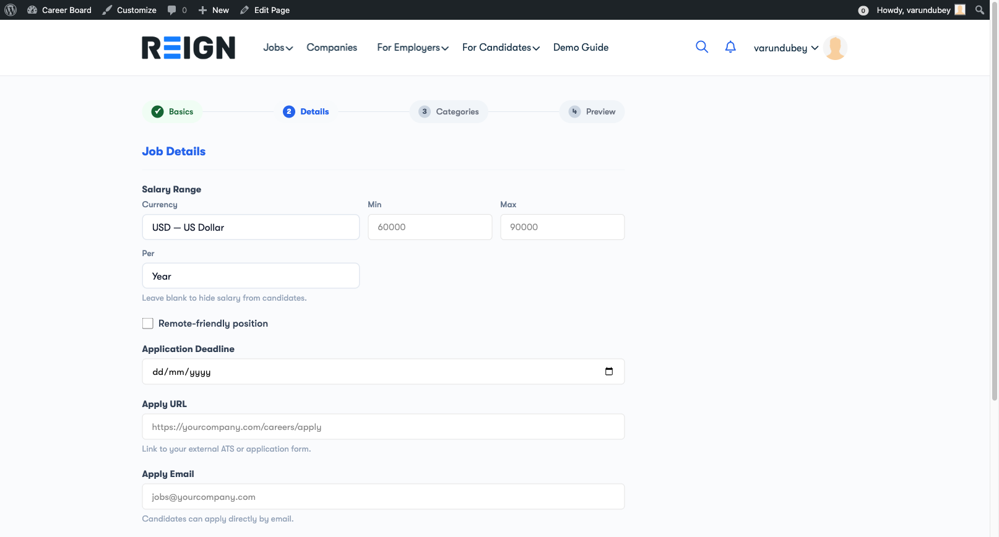

# Post a Job

Jobs are posted from within the **Employer Dashboard** — there is no separate "Post a Job" page. Navigate to your dashboard and click the **Post a Job** tab in the top navigation, or use the **+ Post a Job** button on the Overview tab.

## Before You Post

Make sure you are logged in as a user with the **Employer** role. If you are not logged in, the dashboard will show a prompt to register or log in.

## Step-by-Step: Posting a Job

The job form is a 4-step wizard that walks you through each section of the listing.

### Step 1 — Basics

Enter the core information about the role:

- **Job Title** — the position name (required)
- **Job Description** — full description of the role, responsibilities, and requirements

### Step 2 — Details

Provide the specifics:

- **Location** — city, state/country, or Remote
- **Salary** — optional; enter a range or a fixed amount
- **Job Type** — Full-time, Part-time, Contract, Freelance, or Internship
- **Experience Level** — Entry, Mid, Senior, Lead, or Executive
- **Application Deadline** — optional; date after which the job closes automatically

### Step 3 — Categories

Classify the job so candidates can find it:

- **Job Category** — select the industry or function category
- **Tags** — add relevant tags for better discoverability

### Step 4 — Preview

Review all the information you entered across the previous steps. If everything looks correct, click **Submit Job** to post.

## After Submitting

**If moderation is ON** (default): your job is submitted for admin review. You will see a "Pending review" message. The job goes live after the admin approves it.

**If moderation is OFF**: your job is published immediately and appears on the job board.

You will receive a confirmation email when your job goes live.

## Editing a Submitted Job

You can edit a pending or published job from your **Employer Dashboard → My Jobs → Edit**. Changes to a published job may require re-approval depending on your admin's settings.

## Job Expiry

If your admin has set an expiry period (e.g., 30 days), your job will automatically close on that date. You will receive an email notification before it expires, and you can re-open it from your dashboard.
