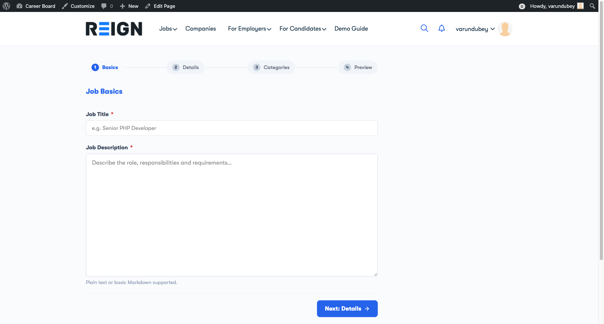
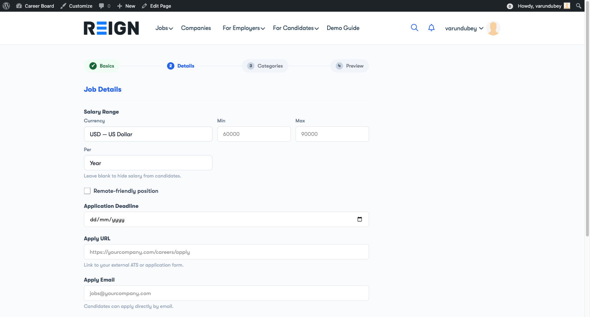

# Post a Job

Post a job from the **Employer Dashboard**: click **Post a Job** in the sidebar (under Jobs), the **+ Post a Job** button pinned at the bottom of the sidebar, or **Post Your First Job** on the Overview. The setup wizard also creates a standalone **Post a Job** page (`/post-a-job/`) with the same form.



## Before you post

Make sure you are logged in as a user with the **Employer** role. If you are not logged in, the dashboard will show a prompt to register or log in.

## Step-by-step: posting a job

The job form is a 4-step wizard that walks you through each section of the listing.

### Step 1 - Basics

Enter the core information about the role:

- **Job Title** - the position name (required)
- **Job Description** - full description of the role, responsibilities, and requirements

### Step 2 - Details

Provide the specifics:

- **Location** - city, state/country, or Remote. When the site requires a location (the default on new sites), a job needs a location or the Remote option before it can be posted
- **Salary** - optional; enter a min and max range, with currency and period (yearly / monthly / hourly)
- **Job Type** - Full-time, Part-time, Contract, Freelance, or Internship
- **Experience Level** - Entry, Mid, Senior, Lead, or Executive
- **Application Deadline** - optional; date after which the job closes automatically
- **Apply URL** - optional; an external link where candidates apply on your own site. When set, the public job page shows an "Apply on Company Site" button instead of the on-site apply form. The URL must start with `http://` or `https://`.
- **Apply Email** - optional; an address candidates can email to apply

### Step 3 - Categories

Classify the job so candidates can find it:

- **Job Category** - select the industry or function category
- **Tags** - add relevant tags for better discoverability

### Step 4 - Preview

Review all the information you entered across the previous steps. If everything looks correct, click **Post Job** to submit. (When editing an existing job, this button reads **Update Job**.)

When the site sells featured placement (needs Pro), this step also shows a checkbox such as "Feature this job: it lists first for 30 days (2 credits)". See [Your Credit Balance](./10-employer-credit-balance.md#featured-job-upgrades).



## After submitting

**If moderation is ON** (default): your job is submitted for admin review. You will see a "Pending review" message. The job goes live after the admin approves it.

**If moderation is OFF**: your job is published immediately and appears on the job board.

You will receive an email when a moderator approves or rejects a job that was held for review. If the site charges credits and your balance is too short when the moderator approves, the job stays Pending and shows **Awaiting payment** in My Jobs until your balance covers it.

Validation messages appear under the field they belong to. Clicking **Next** or **Post Job** twice quickly does not create two jobs.

## Editing a submitted job

You can edit a pending or published job from your **Employer Dashboard → My Jobs → Edit**. Changes to a published job may require re-approval depending on your admin's settings.

## Job expiry

Every job runs until its deadline (the date you set, or the site's listing length, 30 days by default). At the deadline it stops taking applications and leaves the job listings. Its page stays up and tells visitors it has expired, so links you shared keep working. You get an email 3 days before, and your dashboard shows it as **Expired** with a **Reopen** button, which starts a new listing period with a fresh deadline (paid boards charge for it). Applications you already received stay as they are, so you can keep reviewing them.

## Closing a job early

Use **Close** in **My Jobs** when the role is filled or cancelled. The job leaves the listings and stops taking applications, and every applicant you have not hired or rejected is moved to **Closed** and gets one email saying the position is closed. You can reopen a closed job later; the closed applications stay closed.

## Single-page form - When the 4-step wizard is overkill

The default post-a-job experience is a 4-step wizard. For some embed points the wizard is too tall: sidebars, modal overlays, partner pages, single-page sites, and classic themes with limited vertical real estate. WP Career Board ships a second block, **Job Form (Single-Page)**, that puts every field on one screen.

It submits to the same `/wcb/v1/jobs` endpoint, honours the same `wcb_job_form_fields` filter for custom fields, and respects the same employer-role gate. The only thing it does not support is edit mode - editing a job always routes through the wizard from the Employer Dashboard.

### Block settings

- **Board** - target a specific board (multi-board sites only)
- **Show Company Field** - toggle the company name field on or off (on by default)
- **Compact** - tighter vertical rhythm for narrow embed contexts

### Adding the single-page form

In Gutenberg, search for **Job Form (Single-Page)** in the block inserter. In classic editors or page builders, use the shortcode:

```
[wcb_job_form_simple]
[wcb_job_form_simple boardId="42" showCompanyField="false" compact="true"]
```

> When to use which: keep the wizard on your primary "Post a Job" page - the dashboard already places it for you. Reach for the single-page form when you need a job form alongside other content - homepage hero, partner page, sidebar widget, or modal overlay.
