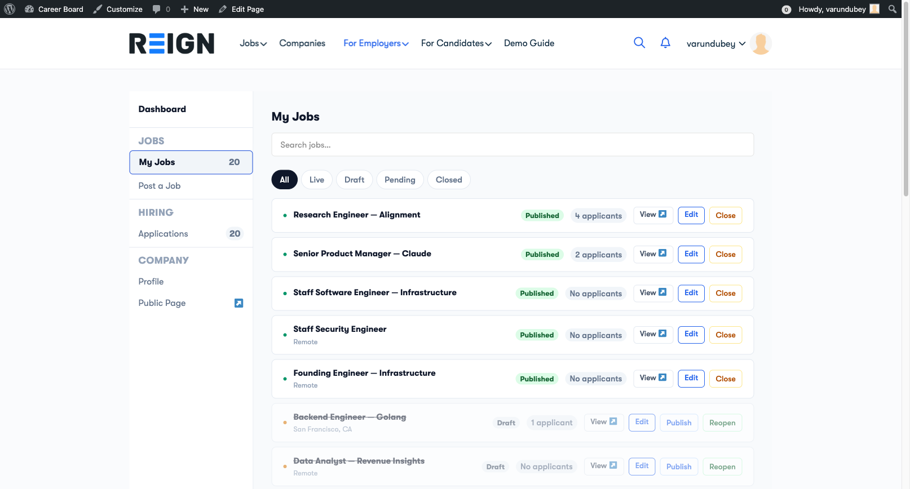
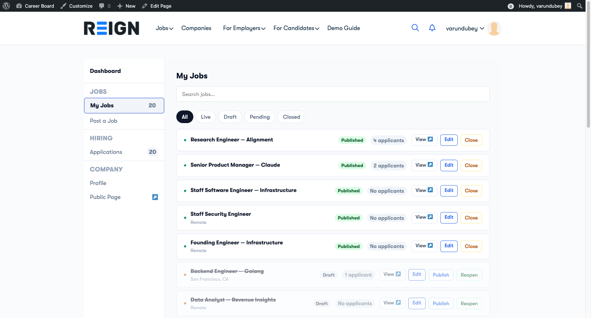

# Manage Your Jobs

The **My Jobs** tab in the Employer Dashboard shows all the jobs you have posted, with quick actions to manage each one.

## Accessing Your Jobs

1. Go to the **Employer Dashboard** page (created by the Setup Wizard)
2. The **My Jobs** tab is active by default
3. You will see a list of all your jobs with their current status

## Job Statuses

| Status | Meaning |
|---|---|
| **Published** | Live on the job board, visible to candidates |
| **Draft** | Saved but not yet submitted for review |
| **Pending** | Submitted, waiting for admin approval |
| **Closed** | No longer accepting applications; hidden from the board |
| **Expired** | Passed the expiry date; same as Closed |

## Actions per Job

Each job card shows these quick-action buttons:

- **View ↗** — opens the public job listing in a new tab
- **Edit** — opens the job for editing in the job form
- **Close** — closes the job and stops accepting applications (published jobs only)
- **Reopen** — puts a closed job back on the board (closed jobs only)
- **Publish** — submits a saved draft for approval (draft jobs only)

## Editing a Job

1. Click **Edit** on any job
2. The multi-step Job Form opens pre-filled with the current data
3. Make your changes and click **Update Job**

> **Note:** If moderation is enabled, edits to a published job may require re-approval. The job stays live while under review.

## Closing a Job

Click **Close** to stop accepting new applications. The job is removed from the job board listing but the data is preserved. You can reopen it later.

Use this when:
- You have filled the position
- You want to temporarily pause applications

## Application Count

Each job card shows the number of applications received. Click the count to jump directly to the Applications view for that job.
