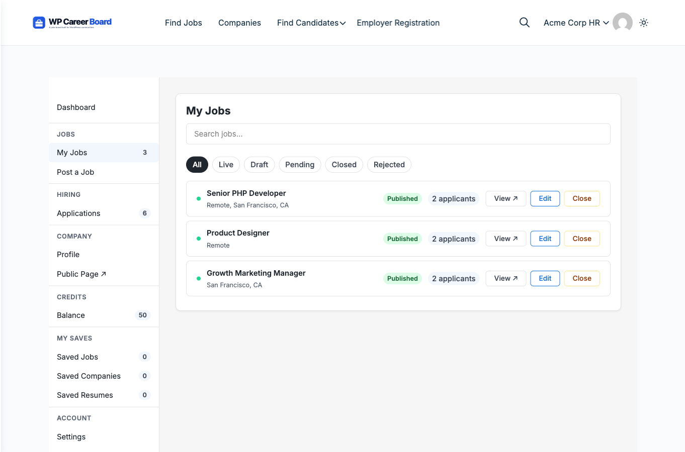
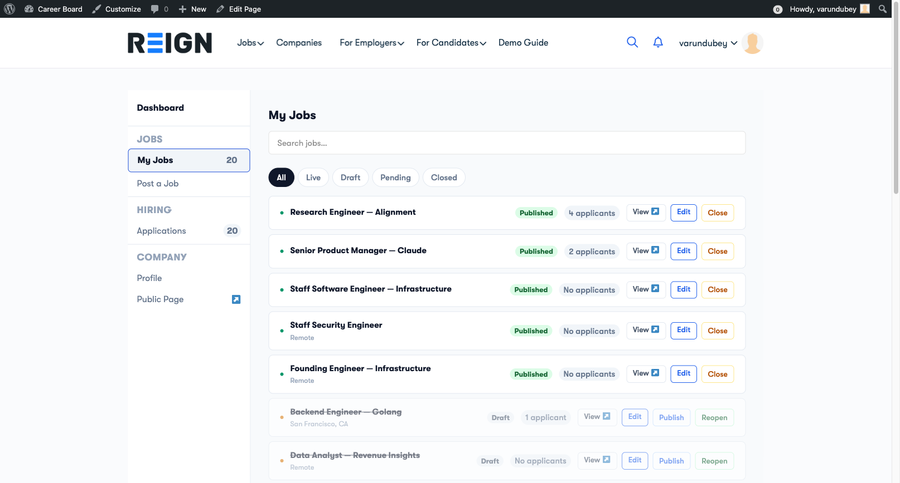

# Manage Your Jobs

The **My Jobs** tab in the Employer Dashboard shows all the jobs you have posted, with quick actions to manage each one.

## Accessing your jobs

1. Go to the **Employer Dashboard** page (created by the Setup Wizard)
2. Click **My Jobs** in the sidebar (under Jobs). Its badge shows your total job count.
3. You will see all your jobs with their current status. Use the search box to find one by title.

My Jobs and Applications are available as soon as you have jobs on file, even if you have not created a company profile. You still need a company profile before posting a *new* job.

Each row shows the job title, location, status badge, a **Featured** badge when it is featured, and an applicant count such as "3 applicants". Click the count to open that job's applications.

## Filtering by status

Filter pills at the top narrow the list: **All**, **Live**, **Draft**, **Pending**, **Closed** and **Rejected**. The **Closed** pill also includes expired jobs.

## Job statuses

| Status | Meaning |
|---|---|
| **Published** (Live) | Live on the job board, visible to candidates |
| **Draft** | Saved but not yet submitted for review |
| **Pending** | Submitted, waiting for admin approval |
| **Awaiting payment** | Approved, but your credit balance did not cover it. It goes live once you top up |
| **Rejected** | The admin declined the job; you can edit and resubmit it |
| **Closed** | You closed it. It no longer takes applications and is hidden from the board |
| **Expired** | It passed its deadline. It no longer takes applications and left the listings, but its page stays up and says it has expired |

## Actions per job

Each row shows buttons that change with the job's status:

- **View ↗** - opens the public job page in a new tab
- **Edit** - opens the job in the job form
- **Pipeline** - with Pro's Application Pipeline, opens that job's applicants in the pipeline. Hidden otherwise
- **Feature** - features a live job so it lists first (only when the site sells featured placement and the job is not already featured). You confirm the credit cost first. See [Your Credit Balance](./10-employer-credit-balance.md#featured-job-upgrades)
- **Close** - closes a live job
- **Publish** - submits a saved draft for approval (drafts only)
- **Resubmit** - sends a rejected job back for admin approval (rejected jobs only). It returns to Pending; it does not publish directly.
- **Reopen** - puts a closed or expired job back on the board with a fresh deadline (paid boards charge for it)

## Editing a job

1. Click **Edit** on any job
2. The multi-step Job Form opens pre-filled with the current data
3. Make your changes and click **Update Job**

> **Note:** If moderation is enabled, edits to a published job may require re-approval. The job stays live while under review.

## Closing a job

Click **Close** when the role is filled or you want to pause. You are asked to confirm. The job leaves the listings and stops taking applications, and every applicant you have not hired or rejected is moved to **Closed** and gets one email saying the position is closed. Applicants you already decided on keep their status. Reopening the job later restores the applicants that closing moved, without emailing them again.

## When a job reaches its deadline

At the deadline a job moves to **Expired** by itself within the hour. Applications you already received stay as they are. Its page keeps working for people who saved or shared the link. It shows that the job has expired, offers similar open jobs and has no Apply button. You get a **Job Ending Soon** email 3 days before the deadline with a link to extend it, and a **Job Expired** email afterwards. Reopen the job to set a new deadline.
