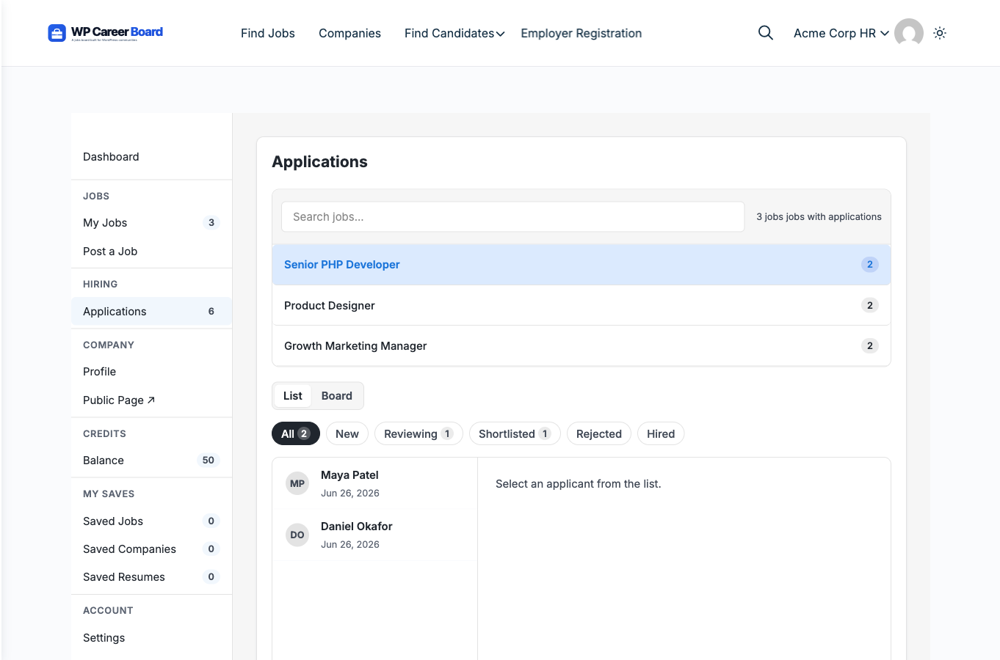

# Review Applications

The **Applications** view in the Employer Dashboard shows every application received across all your jobs. You can filter by job and update the status of each applicant.

## Accessing Applications

1. Open the **Employer Dashboard**
2. Click the **Applications** tab in the top navigation

You will see a list of all applicants across your jobs.

## What You See per Applicant

Each application card shows:

- **Applicant name and initials avatar**
- **Email address**
- **Which job they applied to**
- **Application date**
- **Current status** — see statuses below

## Filtering by Job

If you have multiple jobs, use the **Filter by job** dropdown at the top to see only the applications for a specific listing.

## Application Statuses

| Status | When to use |
|---|---|
| **Submitted** | Application received — not yet reviewed |
| **Reviewing** | You are actively reviewing this candidate |
| **Shortlisted** | Candidate is worth moving forward |
| **Rejected** | No longer considering this applicant |
| **Hired** | Offer accepted — position filled |

## Updating Application Status

Click the **status dropdown** on any application card to change it. Status changes are saved immediately — no page reload required.

> **With WP Career Board Pro:** the status system is replaced by a fully customizable stage pipeline (Screening → Interview → Offer → Hired/Rejected) with a Kanban board view. See [Application Pipeline](./06-application-pipeline.md).

## Contacting Applicants

Click the applicant's email address to open a new email in your mail client. All communication happens outside the plugin — WP Career Board does not have a built-in messaging system in the free version.

## When Candidates Withdraw

If a candidate withdraws their application, it is permanently deleted and will no longer appear in your application list.
