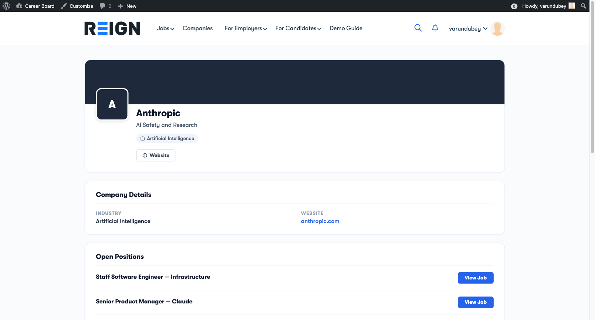
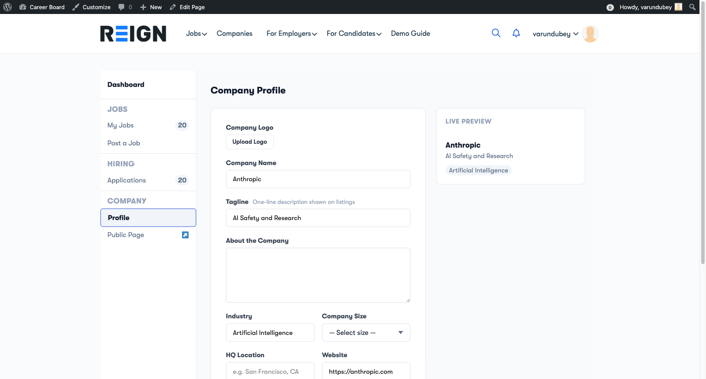

# Company Profile

Every employer gets a public Company Profile page that candidates can browse. It shows your company information and all your active job listings in one place.

## What the Company Profile Shows

- Company name and logo
- Industry and company size
- Website link
- "About the Company" description
- All currently active job listings from this company

Candidates can click through to any individual job listing directly from your company page.

## Setting Up Your Profile

You can edit your company profile from two places:

**From the Employer Dashboard:**
1. Open the **Employer Dashboard**
2. Click the **Company Profile** tab
3. Fill in your company details
4. Click **Save**

**Inline on the public profile page:**
1. Visit your company's public profile page while logged in
2. Click the **Edit** icon next to any field
3. Edit inline and save

## Profile Fields

| Field | Required | Notes |
|---|---|---|
| Company Name | Yes | Displayed as the page title |
| Logo | No | Recommended size: 200×200px |
| Industry | No | Shown as a tag on company cards |
| Company Size | No | e.g., 1–10, 11–50, 51–200 |
| Website | No | Shown as a clickable link |
| About the Company | No | Multi-paragraph description |

## Company Profile URL

Your company profile URL is automatically generated from your company name:
`yourdomain.com/company/your-company-name/`

## Who Sees the Company Profile

The Company Profile page is public — any visitor can see it, even without an account. The **Company Archive** page (if enabled) lets visitors browse all companies on your board.

> **Tip:** A complete company profile with a logo and description significantly increases candidate trust and application rates.
