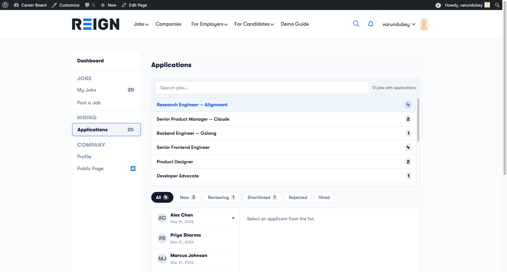

# Application Pipeline

> **Pro feature** - Requires WP Career Board Pro.

The Application Pipeline replaces the free version's status system (Submitted / Reviewing / Shortlisted / Rejected / Hired) with a fully customizable ATS-style stage workflow and a visual Kanban board.

## Free vs Pro

| | Free | Pro |
|---|---|---|
| Application stages | Fixed: Submitted, Reviewing, Shortlisted, Rejected, Hired | Any custom stages you define |
| Pipeline view | List + Board (Kanban) | List + Board (Kanban) |
| Terminal outcomes | Rejected / Hired | Hired / Rejected (configurable, per-board) |
| Stage history | No | Yes |

The List and Board (Kanban) views both ship in the free version - see [Review Applications](./04-review-applications.md). What Pro adds is the ability to **define and rename the stages** those board columns represent, instead of the fixed five statuses.

## Default Stages

When you first enable the Pipeline, these stages are created automatically:

1. **Submitted** (starting stage)
2. **Screening**
3. **Interview**
4. **Offer**
5. **Hired** (terminal - outcome: Hired)
6. **Rejected** (terminal - outcome: Rejected)

You can rename, add, reorder, or delete any of these.

## Configuring Your Stages

Go to **WP Career Board → Boards**, then open the board you want to configure and click the **Stages** tab.

### Adding a Stage

1. Click **+ Add Stage**
2. Enter the stage name (e.g., "Technical Test")
3. Choose a color for the stage badge
4. Toggle **Terminal stage** on if this is a final outcome
5. If terminal, select the outcome: **Hired** or **Rejected**
6. Click **Save**

### Stage Colors

Choose colors that give instant visual meaning:
- Green tones → positive stages (Offer, Hired)
- Red tones → rejections
- Blue/gray tones → neutral stages (Screening, Interview)

### Terminal Stages

When you move a candidate to a terminal stage:
- Their application status is automatically set to **Closed**
- If outcome is **Hired** - the job's hired counter increments
- If outcome is **Rejected** - the candidate receives a rejection email (if enabled)

You must have at least one Hired terminal stage and one Rejected terminal stage.

### Reordering and Deleting

- **Reorder:** Drag and drop stage rows - order determines Kanban column order (left to right)
- **Delete:** If applications are in that stage, you'll be asked to move them to another stage first

## Using the Kanban Board

1. Open **Employer Dashboard → Applications**
2. Select a job, then click the **Board** option in the List / Board toggle

Each column is a stage. Drag applicant cards between columns to move candidates through your pipeline. Click any card to open the full application details.

## Bulk Moving

In list view, select multiple candidates with checkboxes, then use the **Move to Stage** dropdown to move all at once.

## Per-Board Stages

If you use the Multi-Board Engine, each board has its own stage configuration. Go to **WP Career Board → Boards**, select the board, and configure its stages independently.
