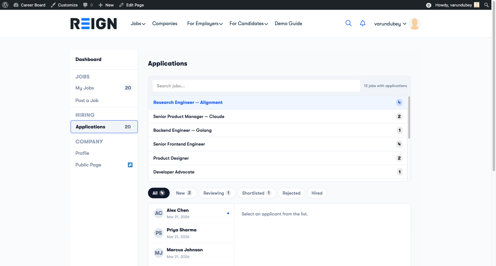

# Application Pipeline

> **Pro feature** - Requires WP Career Board Pro.

The Application Pipeline gives each job a Kanban board of your own hiring stages, for example Screening, Interview, Offer, Hired and Rejected. Employers move applicants between stages instead of using the fixed statuses.

## Free and Pro

| | Free | Pro |
|---|---|---|
| Stages | Fixed: Submitted, Reviewing, Shortlisted, Rejected, Hired | Any stages you define, per board |
| Views | List and Board (Kanban) in the employer dashboard | The Application Kanban block, with stage columns |
| Reach | Applications view | A **Pipeline** link on each job row in My Jobs |

The List and Board views ship in the free plugin - see [Review Applications](./04-review-applications.md). Pro adds the ability to define and rename the stages, and the **Pipeline** link.

## Where employers find it

With Pro active, each job in **My Jobs** has a **Pipeline** button. It opens that job's board. Without Pro the button is not shown.

## Where you set up stages

Stages belong to a job board. Go to **Career Board → Settings → Boards** and click **Manage** on a board to add, rename, recolor, reorder or delete its stages. Every change saves at once.

When a card moves into a stage with the outcome Hired or Rejected, the application's status becomes Hired or Rejected and the candidate gets the usual message.

For the full setup, stage settings, permissions and REST routes, see the Pro documentation: Application Pipeline, "Configuring pipeline stages".
