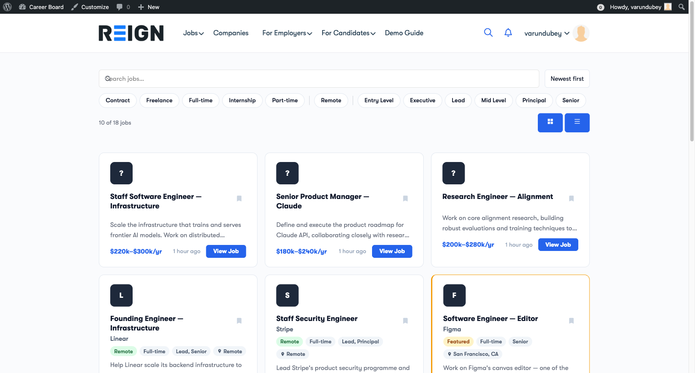

# Introduction to WP Career Board

WP Career Board is a job board plugin for WordPress. It lets employers post jobs, candidates search and apply, and you review and manage it all from wp-admin. Search, filters and applying update in place without a page reload.

## What you get

**For your site visitors:**
- A fast, reactive job board that updates without page reloads
- Search and filter jobs by keyword, category, job type, location, and experience level
- Bookmark jobs to apply later
- Full job detail pages with company information

**For employers:**
- Self-service job posting with a guided multi-step form
- Employer dashboard to manage all posted jobs and applications
- Company profile page visible to all candidates

**For candidates:**
- Candidate dashboard to track all applications in one place
- Saved jobs list (bookmarks)
- Apply as any logged-in member - no dedicated Candidate role required (set "Require Candidate Role" in Settings if you want stricter separation)
- Resume builder and resume management (with WP Career Board Pro)

**For admins:**
- Full admin control over jobs, applications, employers, and candidates
- Moderation queue to approve jobs before they go live
- Email notification system for all key events
- GDPR-compliant data export and erasure tools

## How it is built

- Every page is a block, and every block also works as a shortcode for page builders and the classic editor. See [Adding Blocks](./04-adding-blocks.md).
- Front-end updates use the WordPress Interactivity API instead of jQuery.
- Pages and dashboards follow your theme. Reign and BuddyX Pro have dedicated support.

## Requirements

- **WordPress:** 6.9 or higher
- **PHP:** 8.1 or higher
- **Browser:** Any modern browser (Chrome, Firefox, Safari, Edge)

## Free vs Pro

WP Career Board is free and fully functional as a standalone job board. **WP Career Board Pro** extends it with:

- Resume builder with structured sections
- Custom field builder for jobs, companies, and candidates
- Application pipeline with custom hiring stages on top of the built-in Kanban board
- Credit system to sell job-posting credits to employers
- Multi-board engine
- Job alerts (saved searches sent by email)
- AI job descriptions (auto-generate job posts with AI)
- AI hiring tools: applicant ranking, fit-score and TL;DR summaries, candidate "Recommended for you" matches, and "Write with AI" cover letters (each requires an AI provider configured in Pro)
- Job map (interactive map with geocoded pins)
- Job feed (RSS/XML for aggregators)
- Priority support from the Wbcom Designs team

> **Start free.** You can install WP Career Board and run a complete job board at no cost. Upgrade to Pro when you need advanced features.
