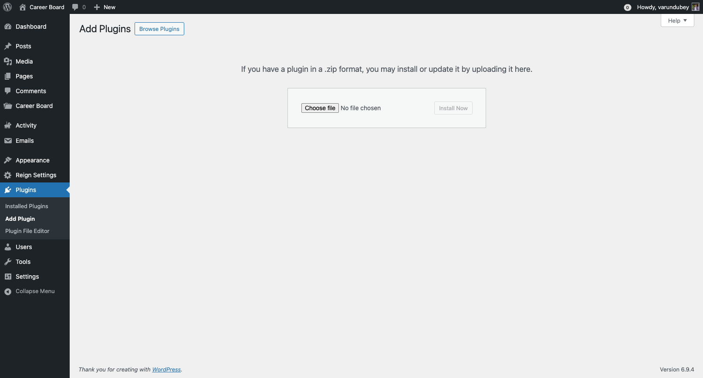

# Installation

WP Career Board is distributed exclusively via [wbcomdesigns.com](https://wbcomdesigns.com). It is not available on WordPress.org.

## Before You Begin

Make sure your site meets these requirements:
- WordPress 6.9 or higher
- PHP 8.1 or higher
- A modern block theme or classic theme (Reign or BuddyX Pro recommended)

## Install the Plugin

1. Log in to your WordPress admin (`/wp-admin`)
2. Go to **Plugins → Add New → Upload Plugin**
3. Click **Choose File** and select the `wp-career-board.zip` file you downloaded from wbcomdesigns.com
4. Click **Install Now**
5. Click **Activate Plugin**

After activation, you will see the **WP Career Board** menu item in your admin sidebar.

## What Gets Created on Activation

When you activate the plugin for the first time, WP Career Board automatically:

- Creates three custom post types: **Jobs**, **Companies**, and **Applications**
- Registers job taxonomies: Category, Job Type, Location, Experience Level, and Tag
- Creates two user roles: **Employer** and **Candidate**
- Adds the **WP Career Board** top-level menu to wp-admin
- Launches the **Setup Wizard** to help you create your pages

## After Activation

You will be redirected to the Setup Wizard. The wizard creates all required pages with the correct blocks in about 30 seconds. See [Setup Wizard](./03-setup-wizard.md) for the full walkthrough.

If you dismiss the wizard, you can run it again any time from **WP Career Board → Settings → Run Setup Wizard** (the button in the page header).

## Updating the Plugin

1. Download the latest version from your account at wbcomdesigns.com
2. Go to **Plugins → Add New → Upload Plugin**
3. Upload the new zip — WordPress will ask if you want to replace the current version
4. Click **Replace current with uploaded**

> **Note:** Your settings, jobs, applications, and user data are preserved on updates.
