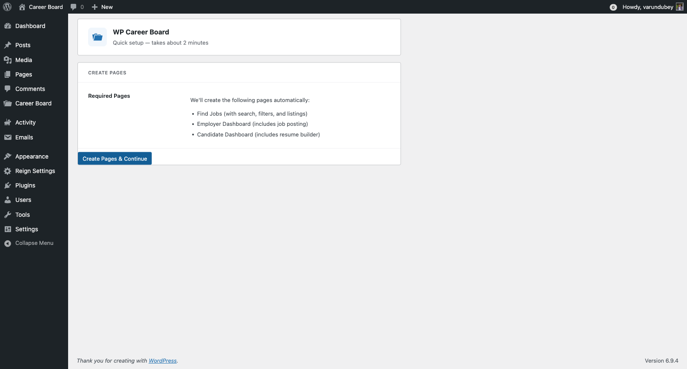
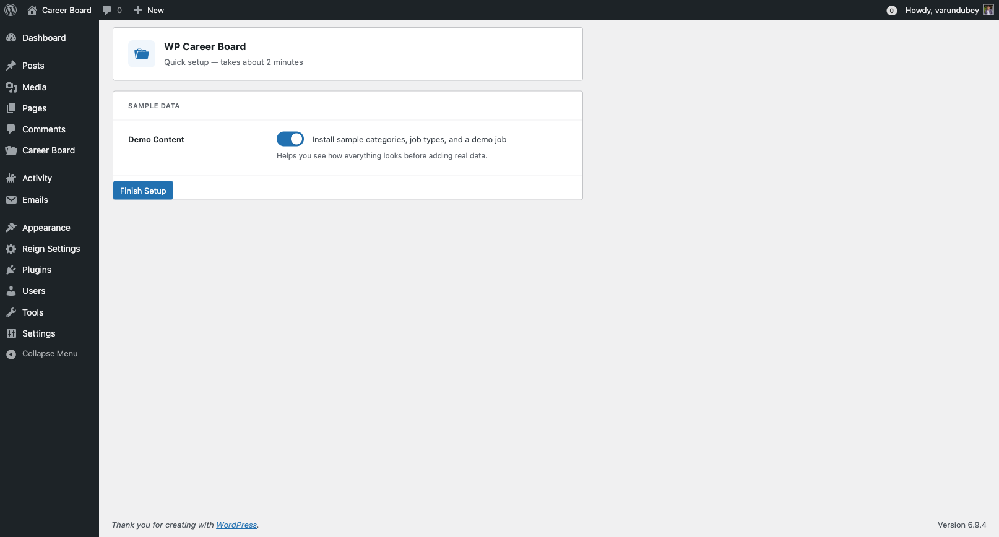

# Setup Wizard

The Setup Wizard is the fastest way to get your job board up and running. It creates all the pages you need in one click.

## What the Wizard Does

The wizard creates the following pages automatically, each with the correct block placed and configured:

| Page | Block | Purpose |
|---|---|---|
| Jobs | Job Search + Job Filters + Job Listings | Main job board browse page |
| Post a Job | Job Form | Employers post new jobs |
| Employer Dashboard | Employer Dashboard | Employer manages jobs + applications |
| Candidate Dashboard | Candidate Dashboard | Candidate tracks applications + saved jobs |

It also optionally loads **sample data** — a set of demo jobs, companies, and applications — so you can see how the board looks with real content before going live.

## Running the Wizard

1. After plugin activation, the wizard launches automatically
2. Click **Get Started**
3. The wizard creates all pages in one step — you will see a progress indicator
4. Optionally click **Load Sample Data** to add demo content
5. Click **Go to Dashboard** to finish

## Running the Wizard Again

If you dismissed the wizard or need to reset your pages:

1. Go to **WP Career Board → Settings**
2. Click **Run Setup Wizard** in the header

> **Safe to re-run.** The wizard checks for existing pages first. If a page with the correct block already exists, it will not create a duplicate.

## After the Wizard

Once complete, your site has a working job board. Next steps:

- **[Configure settings](../admin-guide/01-settings.md)** — set up moderation, job expiry, and page assignments
- **[Set up email notifications](../admin-guide/02-email-notifications.md)** — customize the emails sent to employers and candidates
- **[Assign pages in Settings](../admin-guide/01-settings.md#pages-tab)** — link each page in the Pages settings tab if not done automatically
