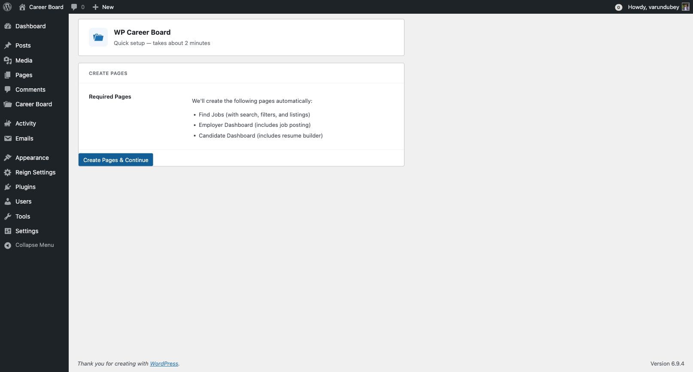
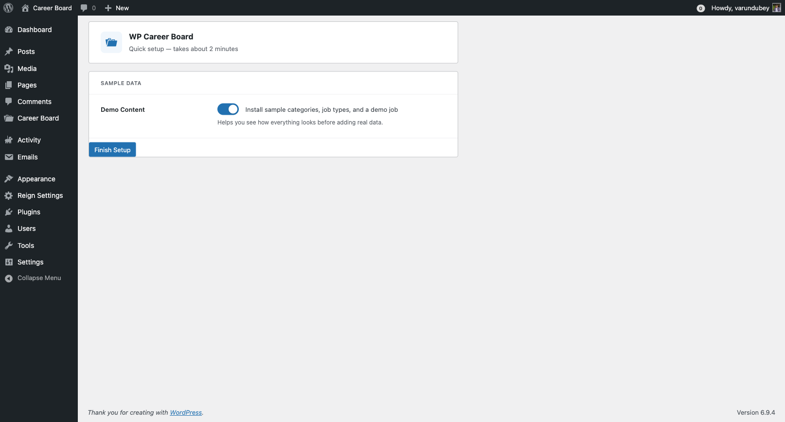

# Setup Wizard

The Setup Wizard is the fastest way to get your job board up and running. It walks you through pages, sign-ups, jobs, emails, and spam protection, then offers sample data.

## How it works

A stepper runs across the top of the wizard showing every step and your progress. The WordPress admin menu is hidden while the wizard runs, so you finish the task instead of wandering off half configured - click **Exit setup** in the wizard header to leave at any time. Every finished step stays reachable: click it in the stepper to reopen and change what you entered.

Every settings step has two ways forward: **Save & Continue** to save your answer and move on, or **Skip for now** to move on without saving. Nothing here is final - every answer can be changed later in **Settings**.

## The steps

### 1. Pages

Creates the pages your board needs, each with the correct block already placed. A page that already exists with the right block is reused, not duplicated - the wizard is safe to run again.

| Page | Block(s) | Purpose |
|---|---|---|
| Find Jobs | Heading + Job Search + Job Filters + Job Listings | Main job board browse page |
| Post a Job | Job Form | Multi-step form for employers to submit listings |
| Employer Registration | Employer Registration | Unified registration for both employers and candidates (users choose "Find a Job" or "Hire Talent") |
| Employer Dashboard | Employer Dashboard | Employer manages jobs + applications |
| Candidate Dashboard | Candidate Dashboard | Candidate tracks applications + saved jobs |
| Find Companies | Company Archive | Browsable company directory |

### 2. Sign-ups

- **Let people sign up** - candidates and employers create their own accounts. This is WordPress's "Anyone can register" setting. Off: only you can add users, and the sign-up forms show a "registration closed" notice.
- **Confirm email addresses** - new accounts click a link in their inbox before they can post or apply. Stops fake and mistyped sign-ups.

### 3. Jobs

- **Publish jobs without review** - off by default; every new job waits for your approval under Career Board → Jobs before candidates see it.
- **Default listing length** - how long a job stays open when the employer sets no deadline.
- **Salary currency** - pre-selected on the job form; employers can still pick another.

### 4. Emails

- **Sender name** - shown as "From" on every Career Board email.
- **Sender email** - use an address on your own domain so emails don't land in spam.
- **Send admin alerts to** - new jobs waiting for review, reports, and other admin notices go here.

### 5. Spam protection

Choose a CAPTCHA provider (None, Cloudflare Turnstile, Google reCAPTCHA v3 invisible, or Google reCAPTCHA v2 invisible badge) and enter its site key and secret key. See [Settings → Anti-Spam](../admin-guide/01-settings.md#anti-spam) for provider details. A honeypot field protects every form regardless of this choice.

### 6. License (Pro only)

Activate your WP Career Board Pro license key.

### 7. How employers pay (Pro only)

Configure how employers pay for job posts (credits, connected payment provider).

### 8. Sample data

Optionally install demo content - companies, published jobs across multiple categories, and taxonomy terms. This lets you see how the board looks with real content before going live. Click **Finish Setup** to complete.

## Running the wizard again

If you dismissed the wizard or need to create missing pages:

1. Go to **Career Board → Settings**
2. Click **Re-run Setup Wizard** at the bottom of the page

Pages you already have are kept and reused. The wizard never overwrites them.

## After the wizard

Once complete, your site has a working job board. Next steps:

- **[Configure settings](../admin-guide/01-settings.md)** - review moderation, listing length, and page assignments
- **[Set up email notifications](../admin-guide/02-email-notifications.md)** - customize the emails sent to employers and candidates
- **[Review page assignments](../admin-guide/01-settings.md#pages)** - confirm each page in the Pages settings tab if anything needs adjusting
