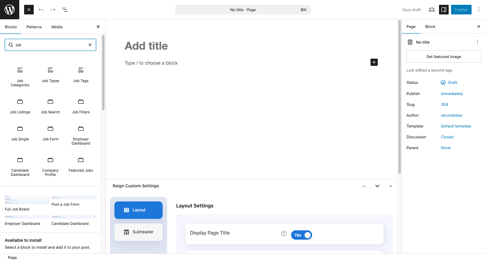
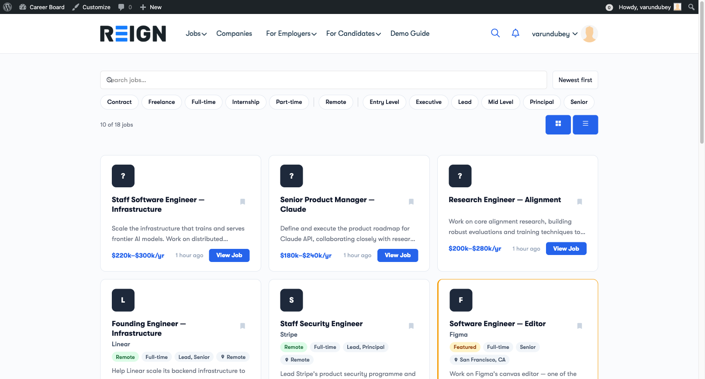

# Adding Blocks to Pages

WP Career Board uses WordPress blocks to display everything on the frontend. Each block handles a specific part of the job board experience.

## Available Blocks

| Block | What It Does |
|---|---|
| **Job Listings** | Reactive grid of jobs — updates on filter/search without page reload |
| **Job Search** | Keyword search bar for the listings grid |
| **Job Filters** | Dropdown filters for category, job type, location, and experience level |
| **Job Single** | Full job detail page with an inline application panel |
| **Job Form** | Multi-step form for employers to post jobs |
| **Featured Jobs** | Static grid of featured jobs — good for homepage use |
| **Employer Dashboard** | Tabbed dashboard: My Jobs, Applications, Company Profile |
| **Candidate Dashboard** | Tabbed dashboard: My Applications, Saved Jobs |
| **Company Profile** | Public company profile with active job listings |
| **Company Archive** | Searchable directory of all companies |

## Adding a Block to a Page

1. Open any page in the WordPress editor (Gutenberg)
2. Click the **+** button to add a block
3. Search for "Career Board" or the block name
4. Click the block to insert it

## The Job Board Page (Recommended Layout)

For the main jobs page, use this block arrangement in order:

1. **Job Search** — sits at the top, provides the search input
2. **Job Filters** — sits below search, provides the filter dropdowns
3. **Job Listings** — sits below filters, displays the results

All three blocks are connected — they automatically coordinate with each other on the same page. No configuration required.

## Configuring Block Settings

Some blocks have settings you can adjust in the block sidebar:

**Job Listings:**
- **Jobs per page** — how many jobs to show before the "Load more" button (default: 10)
- **Layout** — grid (default) or list view

**Featured Jobs:**
- **Jobs per page** — how many featured jobs to display

**Company Archive:**
- **Companies per page** — how many companies per page
- **Layout** — grid or list

To access these settings, click the block in the editor and look at the **Block** panel in the right sidebar.

## The Setup Wizard vs Manual Setup

The Setup Wizard creates pages with the correct blocks already placed. You only need to add blocks manually if:
- You want to embed the job board on an existing page
- You want a custom layout or custom page template
- You dismissed the wizard

> **Tip:** If the Setup Wizard already created your pages, you don't need to add blocks manually. Check **WP Career Board → Settings → Pages** to see which pages are currently assigned.
