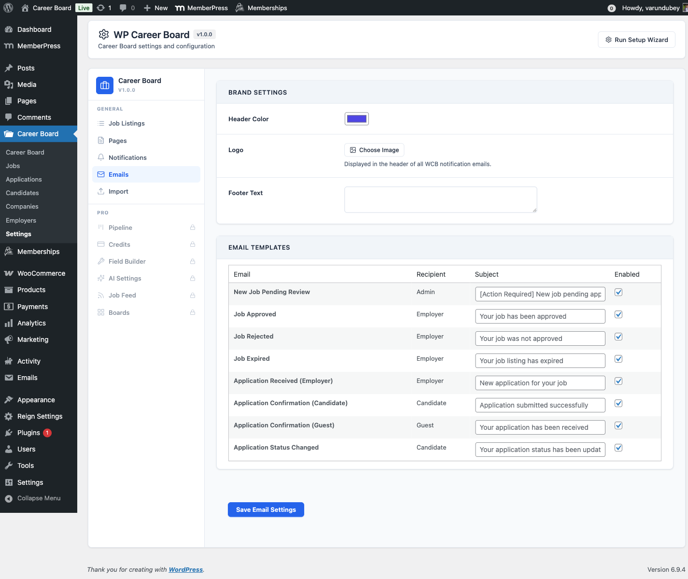

# What's New in 1.7.0

WP Career Board and WP Career Board Pro ship in lockstep at 1.7.0.
Install both updates together. This page highlights the
customer-facing changes across the 1.5.0-1.7.0 and 1.3.0-1.4.x
cycles. For the full line-by-line history, see the changelog in
`readme.txt`.

## 1.7.0

* New      - Full mobile REST API for companion apps, including an
  app-config endpoint and viewer-relative fields on job cards.
* New      - Members can report other members, and site owners can
  block members and suspend candidates.
* New      - Members can delete their own account from within the app.
* New      - Guest applications are linked to a member account
  automatically when someone registers with the same email address.
* New      - Server-side content filtering for job listings.
* Improve  - Employers can see and manage their jobs and applications
  before creating a company profile.
* Improve  - Accessibility pass across the frontend with stronger text
  contrast and 40px minimum tap targets.
* Improve  - Faster on large sites through indexed application
  lookups, a version-keyed company-list cache, and primed user caches
  that remove per-row lookups.
* Improve  - Old job-view records are pruned automatically on a daily
  schedule.
* Fix      - The employer dashboard no longer shows a "set up your
  company profile first" prompt next to a list of the employer's
  existing jobs.
* Fix      - The public company directory reflects brand edits
  (tagline, industry, size, location) immediately instead of after a
  cache delay.
* Fix      - The jobs archive no longer returns a 404 after the plugin
  is reactivated.
* Fix      - CSV exports are compatible with PHP 8.4 and later.
* Security - Job listing and application detail reads are scoped to
  their owner.
* Security - Blocked members can no longer see listings or single jobs
  on the server-rendered frontend.
* Compat   - Aligned with WP Career Board Pro 1.7.0. Install both
  updates together.

## 1.6.0

* New      - The plugin is now fully translation-ready and bundles
  German, French, Spanish, Dutch and Korean translations; every
  interface string loads through WordPress's standard translation
  system.
* New      - Notification email bodies are now editable per template
  from the Emails settings, each with a ready-to-use default.
* Fix      - Notification emails no longer send with an empty body;
  the message body falls back to a sensible default when left blank.
* Fix      - The "Manage License" link is back on the WP Career Board
  plugins-screen row.
* Compat   - Aligned with WP Career Board Pro 1.6.0. Install both
  updates together.

## 1.5.0

* Improve  - Unified the admin colour tokens onto the same canonical
  namespace as the frontend, so admin and frontend theme consistently
  from one source.
* Improve  - Admin buttons now meet the 40px minimum tap target, and
  the bookmark, layout, view-switch and settings-toggle controls show
  a keyboard focus ring.
* Improve  - Admin status badges and the application detail screen now
  use the semantic colour tokens.
* Fix      - Tinted banners (onboarding notice, form success message,
  status badges) are now readable in BuddyX and BuddyX Pro dark mode
  instead of showing light text on a light background.
* Fix      - The recommended jobs grid no longer collapses its columns
  to zero width.
* Fix      - The settings toggle knob and setup-wizard controls now
  position correctly under right-to-left languages.
* Compat   - Aligned with WP Career Board Pro 1.5.0. Install both
  updates together.

## 1.4.6

* Compat - Aligned with WP Career Board Pro 1.4.6, which reworks the Field
  Builder so custom fields are defined once and applied to every board. The
  free plugin has no functional changes in this release.

## 1.4.5

* Fix - BuddyX 5.1 theme compatibility. WP Career Board now maps its colors to
  BuddyX 5.1's token system (and dark mode), so dashboard navigation labels,
  "View all" links and sidebar buttons render legibly instead of white-on-white
  or as solid coral pills.
* Fix - Custom fields added with the Pro Field Builder now render and save
  correctly on forms for every field type - dropdown, multi-select, date range,
  salary range, video URL, file link, location and repeater. Several previously
  rendered as a plain text box and some did not save.

## 1.4.4

* Fix - The empty-state "Clear filters" button label stays legible under
  themes that force a button text color (such as BuddyX). It previously
  rendered blank where the theme painted the label the same color as the
  button background.

## 1.4.3

* New - The Job Listings block filter sidebar is now customizable. In the
  block settings you can reorder the filter groups (Job type, Experience,
  Category, Tags, Location, Job board, Salary) and hide any you do not need.
  Settings are per block, so each Job Listings placement can differ.
* Improve - WP Career Board now adapts to BuddyX and BuddyX Pro 5.1 light
  and dark color modes. Card avatars, dashboards, buttons, and widgets
  re-color correctly in dark mode (previously only Reign's dark mode was
  handled).
* Fix - The Job Listings block no longer emits PHP warnings when it
  renders with no matching jobs.
* Dev - New `wcb_notification_created` action fires whenever a notification
  is created, so a central notification center (such as BuddyNext) can
  mirror Career Board notifications.

## 1.4.2

* Fix - Banning an employer now takes effect. The Employers admin
  screen (Career Board -> Employers) gains Ban and Unban actions
  (per-row and bulk) plus a Status column. Banning an employer
  immediately removes every Career Board ability from that account.

## 1.4.0 - AI-assisted hiring and a Kanban board

This is the largest release of the cycle. The headline is AI-assisted
hiring on the dashboards, a List / Board (Kanban) view for
applications, and the change that lets any logged-in member apply
without a dedicated Candidate role.

### Any logged-in member can apply

Any logged-in member can now apply to jobs, save jobs, build a resume
(Pro), and use the candidate dashboard without being given a separate
Candidate role - ideal when the job board is part of a community site.
If you want stricter separation, turn on **Require Candidate Role**
under **Career Board -> Settings -> Job Listings** (or use the
`wcb_candidate_requires_role` filter) to reserve the candidate
experience for the Candidate role.

### List / Board toggle on the employer dashboard

The Employer Dashboard Applications tab now has a **List / Board**
toggle. The Board groups applicants into status columns - Submitted,
Reviewing, Shortlisted, Hired, and Rejected. Drag a card to change an
applicant's status, and the board, list, status emails, and AI
ranking all stay in sync. (Pro adds custom hiring stages on top of
this built-in board.)

### AI hiring tools (require Pro and an AI provider)

WP Career Board exposes AI hooks that Pro answers when an AI provider
is configured:

* **Applicant ranking** - rank a job's applicants by AI fit. Each
  applicant shows a fit-score badge, the list sorts best-first, and
  the applicant detail shows the reasoning.
* **TL;DR summaries** - each applicant shows a one-line summary on
  load once scored.
* **Recommended for you** - the Candidate Dashboard overview shows a
  set of AI-matched jobs.
* **Write with AI** - the apply panel can draft a cover letter from
  the candidate's resume and the job, ready to edit before applying.
* **Generate with AI** - the job form can auto-generate a structured
  job description (headings, paragraphs, and bullet lists).

### Sample data without re-running the wizard

You can install or remove the demo/sample data straight from
**Career Board -> Settings**, without re-running the setup wizard.

### Notifications panel redesign

The dashboard Notifications panel was redesigned with clearer read
and unread states, **Mark all read** and **Clear all** controls, and
an always-visible per-row delete button (40px tap target on mobile).
Notifications that pointed at the homepage now render non-clickable
instead of bouncing to the home page.

## 1.3.0 - Account self-service and clearer moderation

### Account Settings in the dashboard

Candidates and employers can update their display name and email and
change their password directly in the dashboard, instead of being
sent off to wp-login.

### Rejected jobs and Resubmit

Rejected job listings now show as "Rejected" (not "Draft") in the
employer dashboard, with a **Resubmit** action. Resubmitting sends
the job back for admin approval instead of publishing it directly.

### My Jobs and applications fixes

* A newly posted job appears in My Jobs immediately, without a manual
  page reload.
* A job posted before you saved a company profile is adopted into My
  Jobs when the company is created.
* Saving a company from its profile page persists across reloads.

## Email and notification quality

The **Test Send** button on the Emails settings tab
(**Career Board -> Settings -> Emails**) succeeds even when a template
is toggled off, so admin previews no longer report a false "Failed".
Test sends are logged separately so they do not pollute production
delivery metrics.

## Upgrade notes

* Lockstep: install Free 1.4.3 and Pro 1.4.3 together. The Pro
  dependency check refuses to load against an older Free.
* Versions: the `WCB_VERSION` and `WCBP_VERSION` constants both move
  to `1.4.3`. The stable tag in `readme.txt` matches.
* No data migration is required for the 1.4.x updates.
