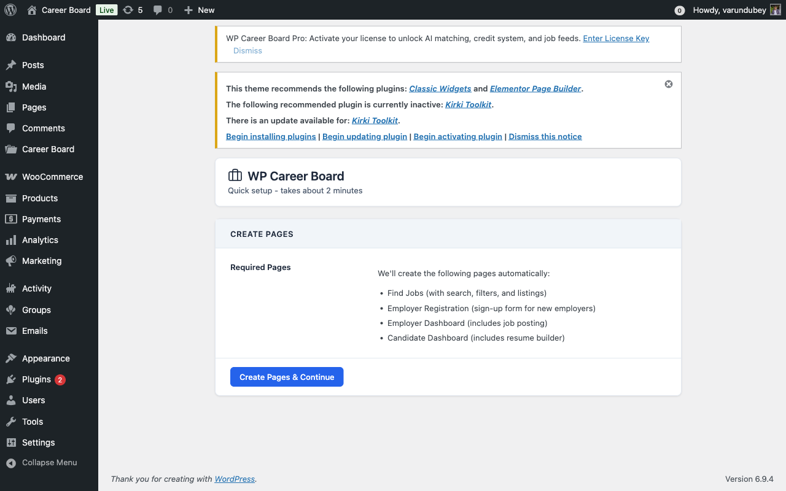
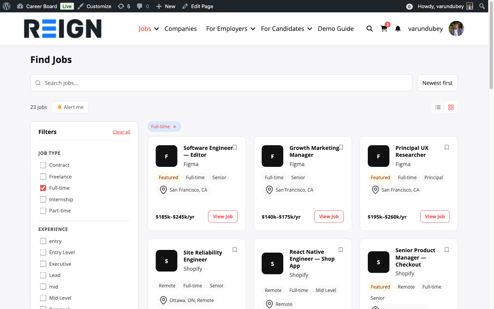
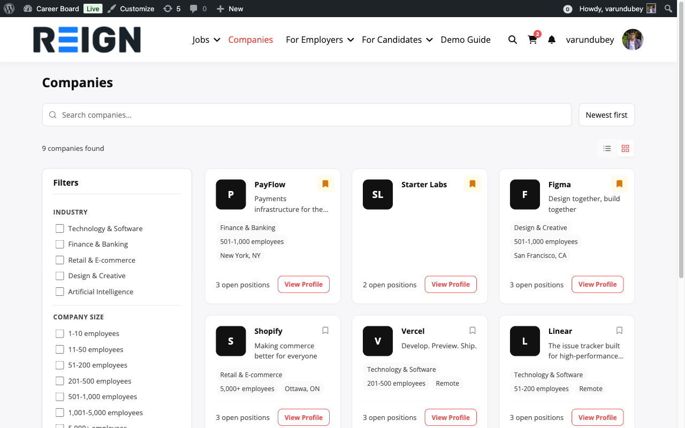
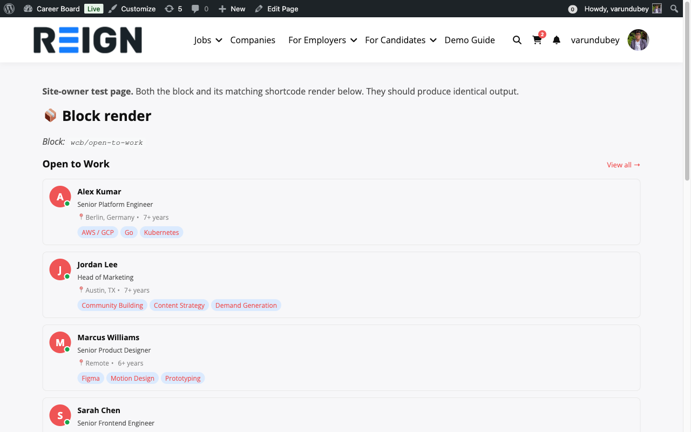
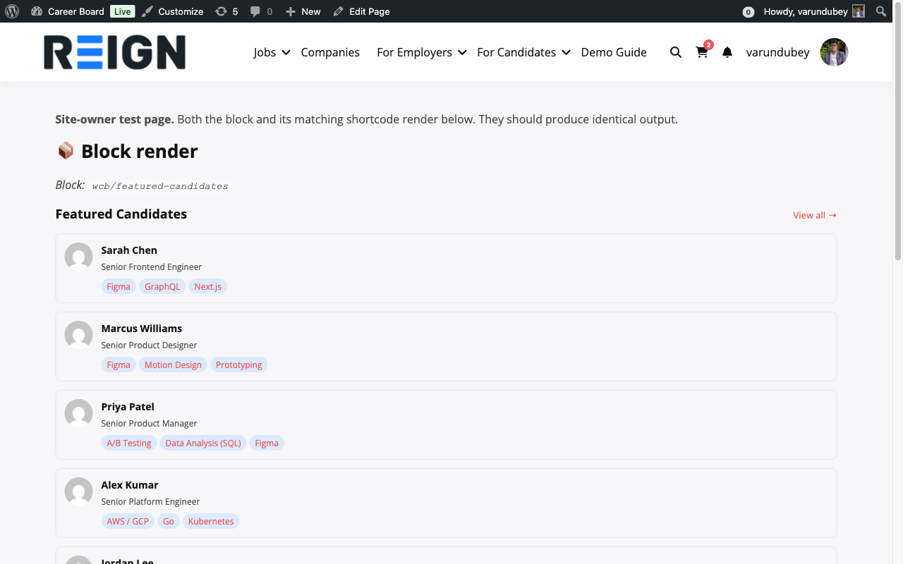
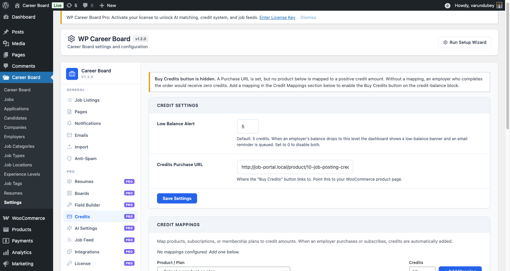

# What's New in 1.2.0

Released May 2026. WP Career Board 1.2.0 is the first public release
since 1.0.x. It rolls up everything the 1.1.0 dev cycle produced
(single-page job form, bulk applicant CSV export, salary range slider,
deadline reminders, guest resume uploads, page-builder shortcode
compatibility, rebuilt admin Edit Application screen, BuddyPress
group-scoped boards, tiered credit pricing, and more) plus the QA
roll-up that closed every Basecamp bug card from the 1.1.x cycle.

Free and Pro ship in lockstep at 1.2.0. Install both updates together.

## What customers see right away

### A centered setup wizard

The first-run wizard now sits centered on wide screens instead of
left-aligned. Same content, less cognitive friction.

### A working Find Jobs filter row

Apply any filter on the Find Jobs page and the active-filter chip row
now has comfortable spacing above the job cards. The filter-panel
toggle chevron now renders through the unified Lucide icon system, so
it matches every other icon on the site.

### Companies archive that aligns properly

The Companies grid now keeps meta chips at the same vertical position
across every card, regardless of how long each tagline is. Footer
("View Profile") pins to the bottom of every card so the grid reads
as a clean row.

### My Applications as a proper table

The `[wcbp_my_applications]` shortcode and matching block now render
as a semantic table with Job / Status / Submitted column headers.
Candidate view shows just the candidate's own applications; employer
view (when used with the `employerId` attribute) prepends an
Applicant column.

On narrow viewports the table collapses to a card layout with each
row's data labeled in-place, so phones see the same data structure
without a horizontal scrollbar.

## What Pro customers see

### Open to Work widget with real candidate info

The Open to Work sidebar widget now reads the resume form's uploaded
photo (not the BuddyPress / Gravatar avatar), shows the candidate's
location, displays years of experience, and lists their top three
skills. When the resume form has not been completed yet, the widget
falls back to an initial-letter chip in the brand color.

### Featured Candidates with reliable skill display

The Featured Candidates block now falls back to skill data stored in
resume meta when the taxonomy is empty, so candidates whose
skills-sync hook did not fire still display correctly.

### Credits admin notice when setup is incomplete

A new yellow banner appears on Settings → Credits when a Purchase URL
is set but no product is mapped to a positive credit amount. Without a
mapping, an employer who completes the order would receive zero
credits. The Buy Credits button on the credit-balance block stays
hidden until the mapping is added.

## What admins see in workflows

### Test Email button now works regardless of template status

Previously, clicking Send test on an email template that was toggled
off in settings would silently fail (the early-return in `send()`
skipped both `wp_mail()` and the log row). The endpoint reported
`sent: false` and the JS button painted "Failed".

1.2.0 adds a public `AbstractEmail::test_send()` bridge that bypasses
the enabled gate, dispatches the email, and writes a `sent_test`
status row to the notifications log so admin previews stay separate
from production delivery metrics in the activity log.

### Direct metaFilter on the Job Listings block

The Job Listings block has a `metaFilter` attribute (and the matching
`?meta_<key>=<value>` REST query param) that filters jobs by post-meta.
Pre-1.2.0 this required registering each meta key through the
`wcb_jobs_allowed_meta_filters` PHP filter first.

1.2.0 auto-allows any `_wcb_*` namespaced meta key. The plugin owns
that prefix, so there is no probe risk; customers can drop the block
in the editor and use any of our job meta as a filter without writing
PHP. Custom or non-WCB meta still requires the existing opt-in filter.

## Pair release

Pro 1.2.0 ships in lockstep. Both plugins must be at the same version
at runtime. See Pro's What's New for the Pro-side feature list
(single-page resume form, BuddyPress group-scoped boards, tiered
credit pricing, BP activity stream integration, member directory
filters, group-scoped moderation, the rebuilt admin Boards tab with
pagination + search, and more).

## Upgrade notes

* Lockstep: install Free 1.2.0 and Pro 1.2.0 together. The Pro
  dependency check refuses to load against an older Free.
* Versions: the WCB_VERSION and WCBP_VERSION constants both move to
  `1.2.0`. Stable tag in readme.txt matches.
* Translations: the .pot files have been regenerated and now cover
  every string in the codebase as of 1.2.0 (1172 Free strings, 696
  Pro strings).
* No data migration required.
